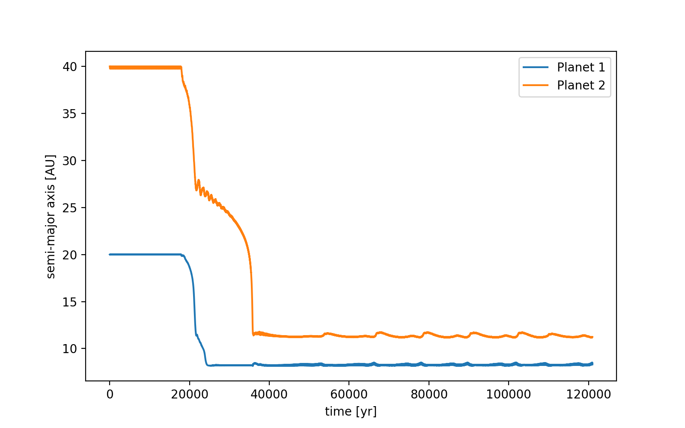
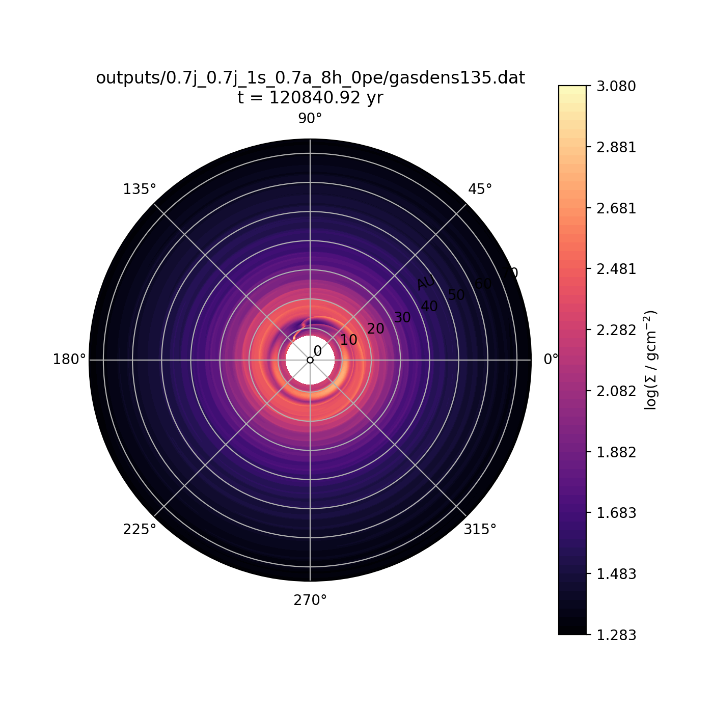
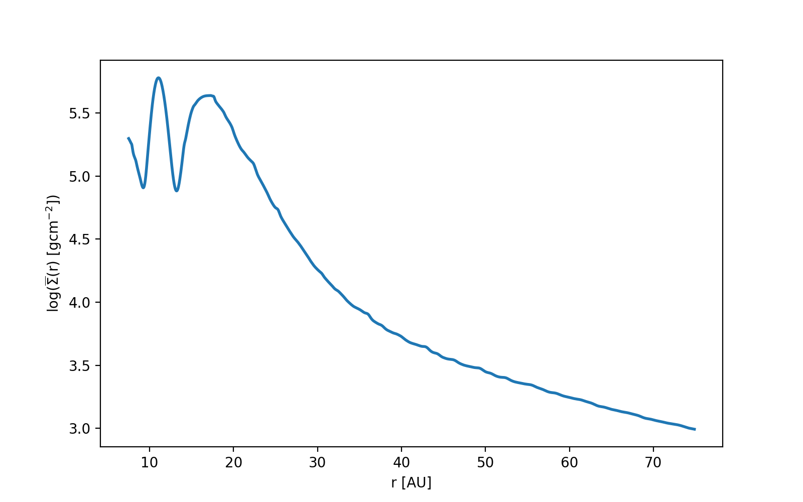

notes::
semi_major_axes_plot:: 
period_ratio:: 1.60 ± 0.04
period_ratio_plot:: 
suggested_resonance:: 3:2
resonant_angles_plot:: 
eccentricity_plot:: 
e1:: 0.012
e2:: 0.006
gas_density_plot:: 
azimuthally_avged_surface_density_plot:: 
