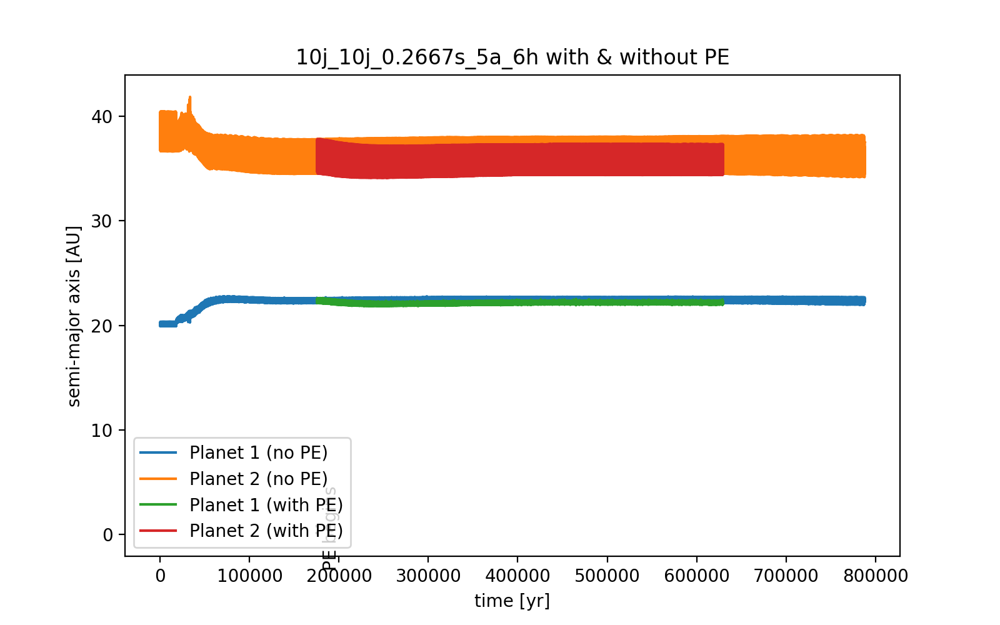
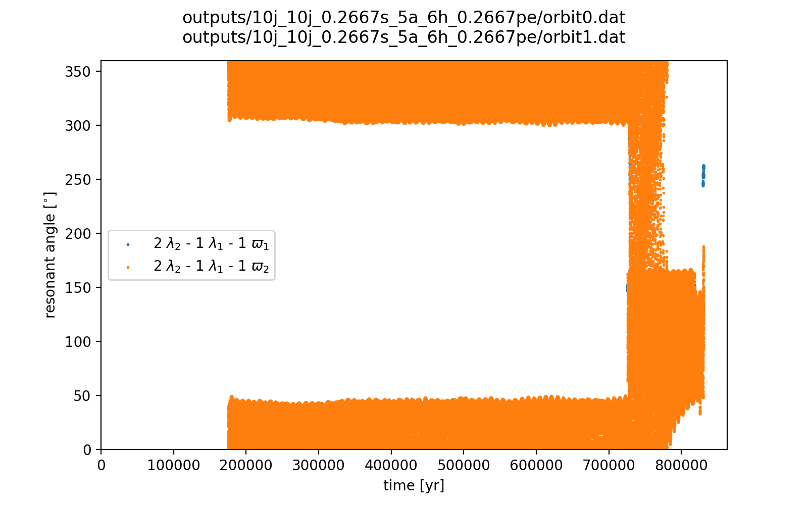
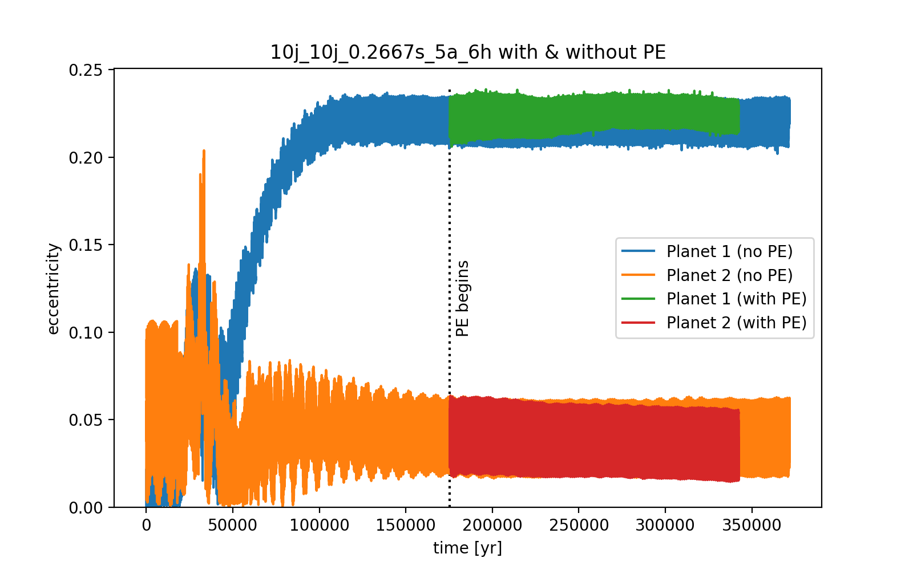
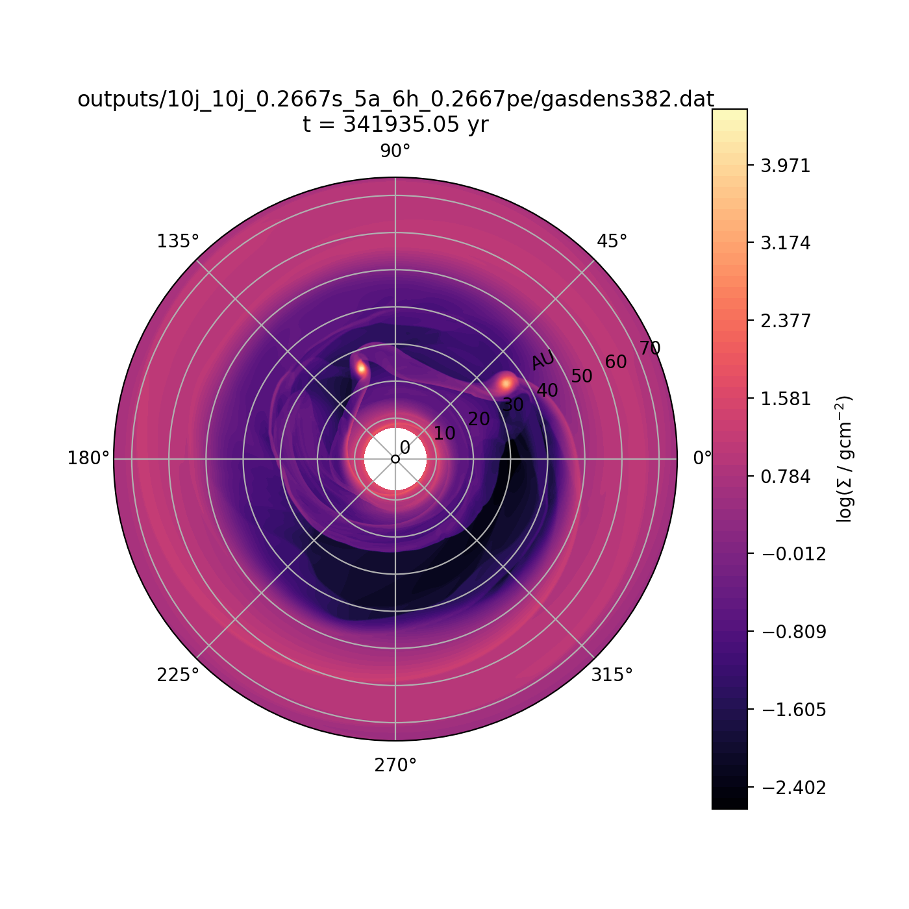
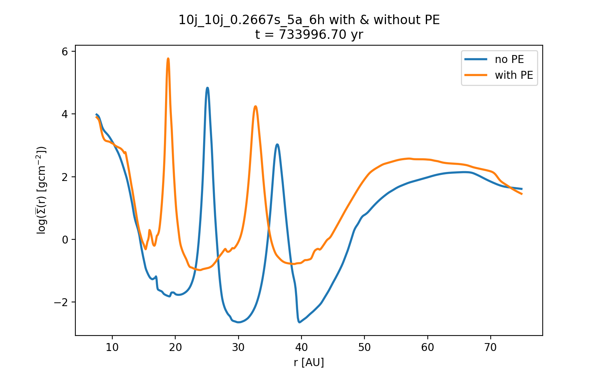

notes:: check PE plots -- gas density plot not consistent with semi-major axes?
semi_major_axes_plot:: 
period_ratio:: 2.08 ± 0.08
period_ratio_plot:: 
suggested_resonance:: 2:1
resonant_angles_plot:: 
eccentricity_plot:: 
e1:: 0.216
e2:: 0.034
gas_density_plot:: 
azimuthally_avged_surface_density_plot:: 
