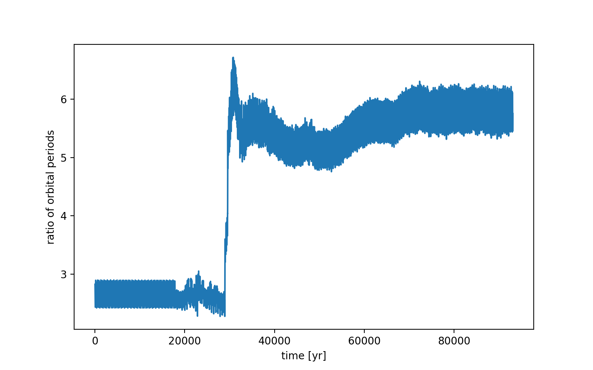
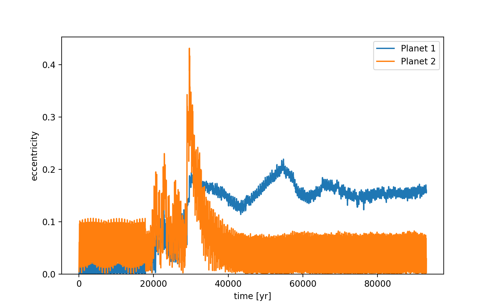
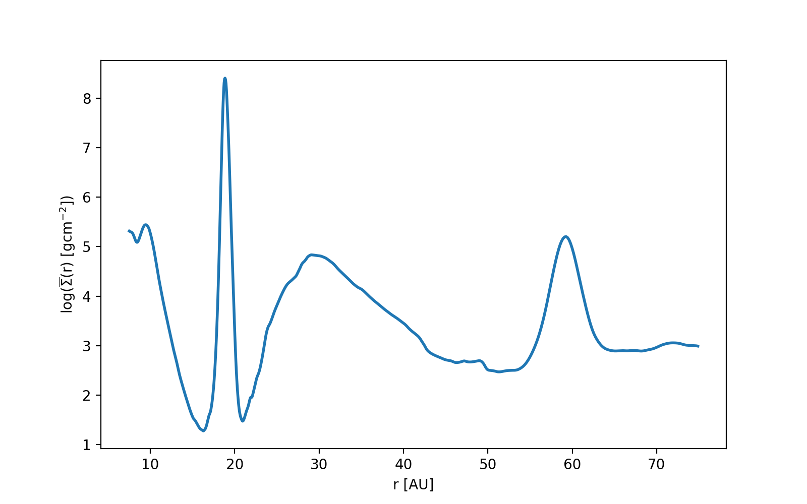

notes:: outwards migration
semi_major_axes_plot:: 
period_ratio:: 5.81 ± 0.25
period_ratio_plot:: 
suggested_resonance:: 
resonant_angles_plot:: 
eccentricity_plot:: 
e1:: 0.155
e2:: 0.040
gas_density_plot:: 
azimuthally_avged_surface_density_plot:: 
