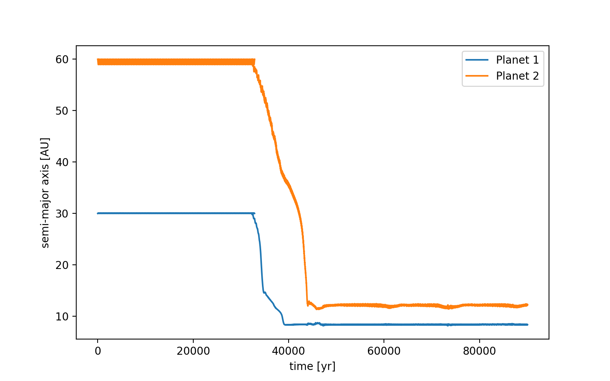
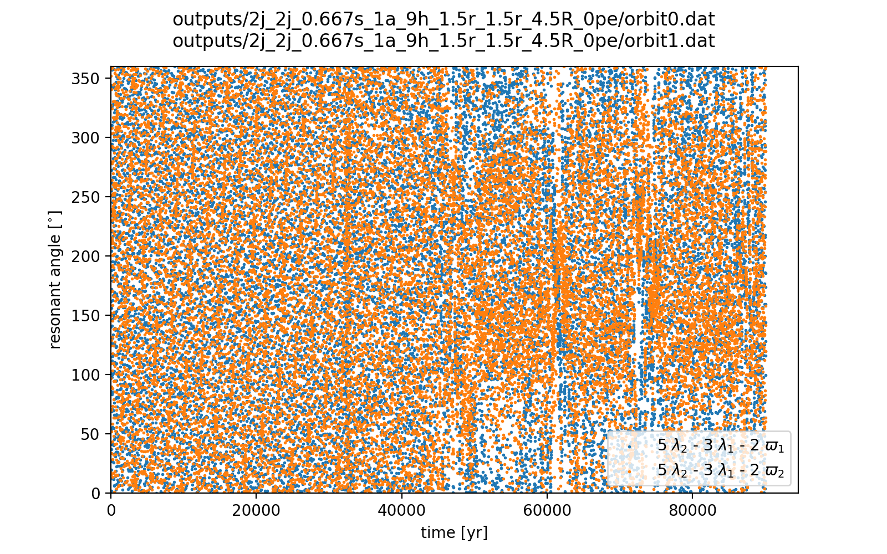
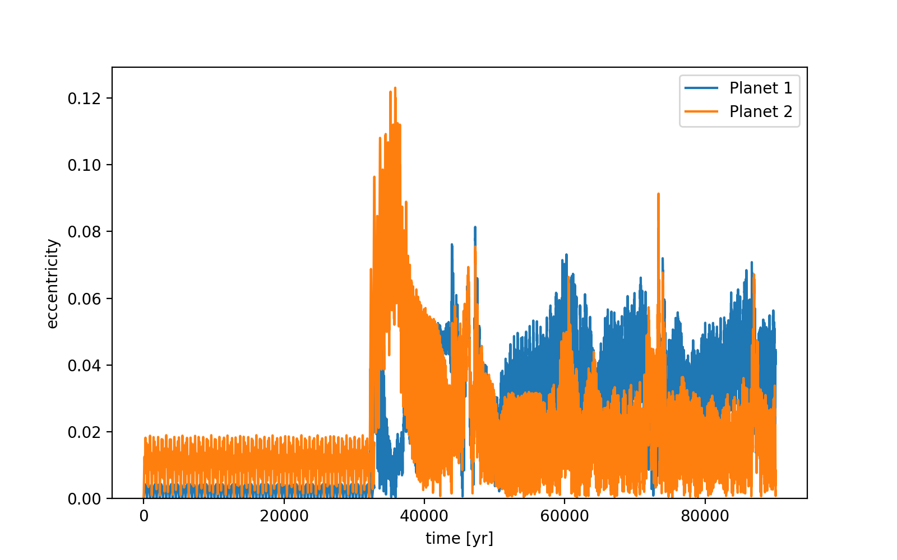
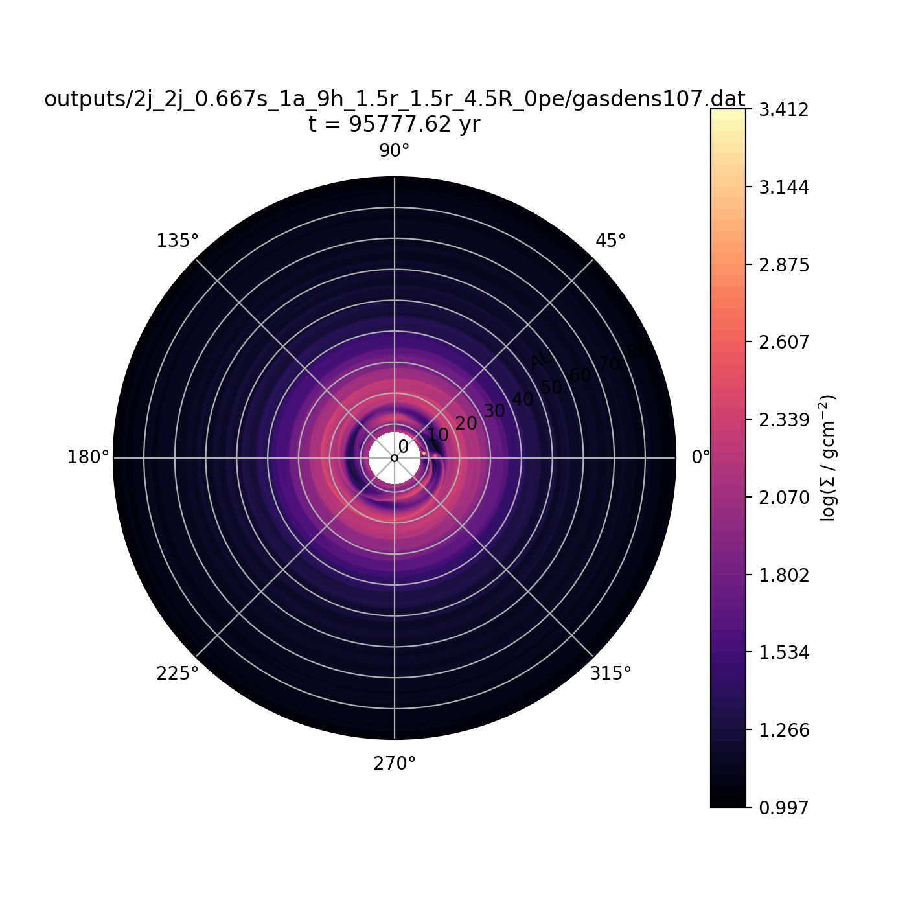
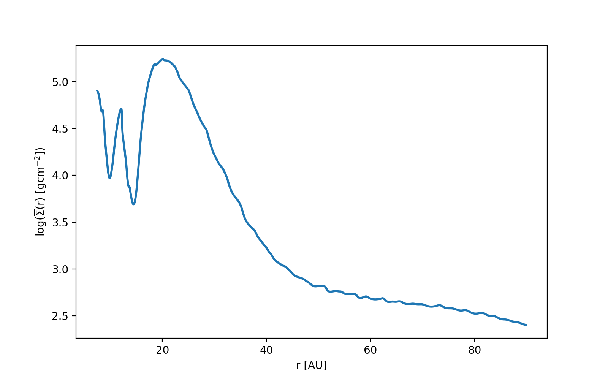

notes::
semi_major_axes_plot:: 
period_ratio:: 1.74 ± 0.03
period_ratio_plot:: 
suggested_resonance:: 5:3
resonant_angles_plot:: 
eccentricity_plot:: 
e1:: 0.038
e2:: 0.018
gas_density_plot:: 
azimuthally_avged_surface_density_plot:: 
