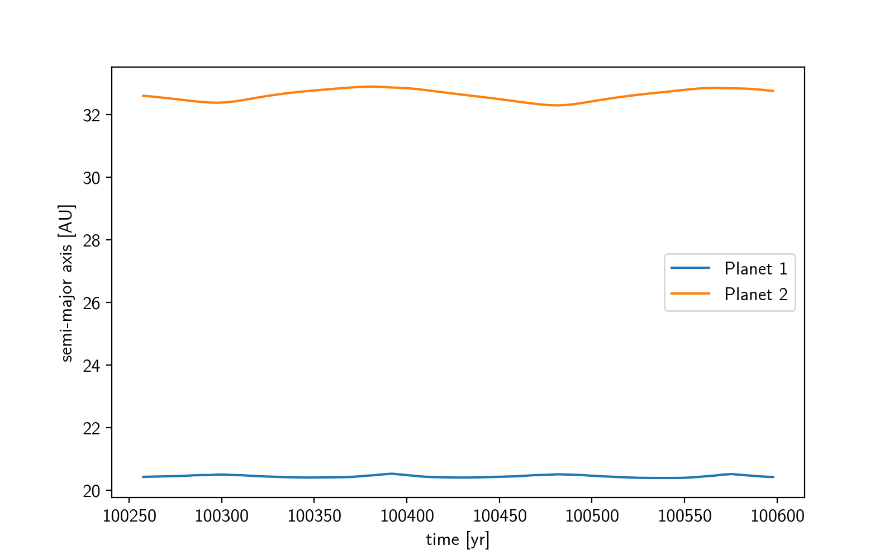
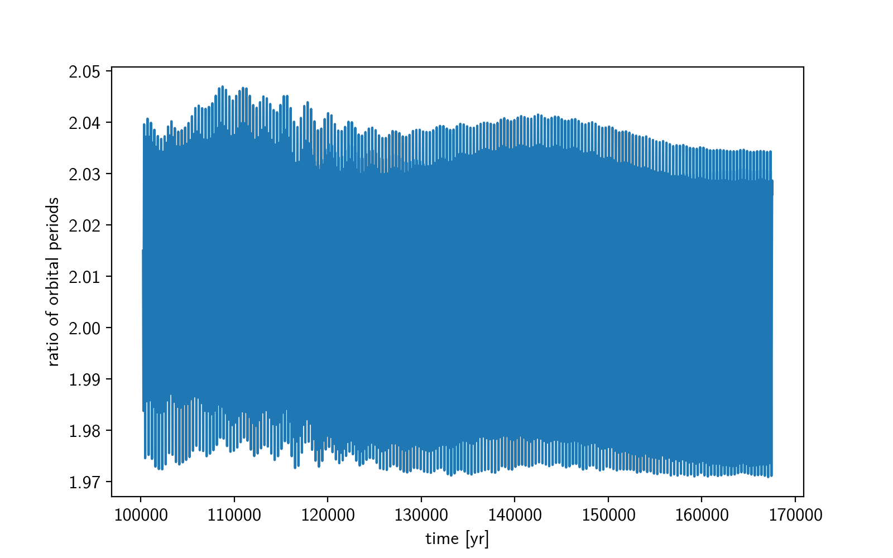
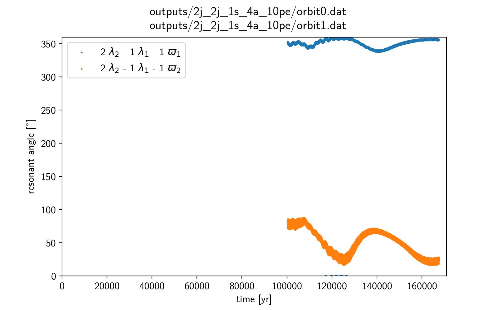
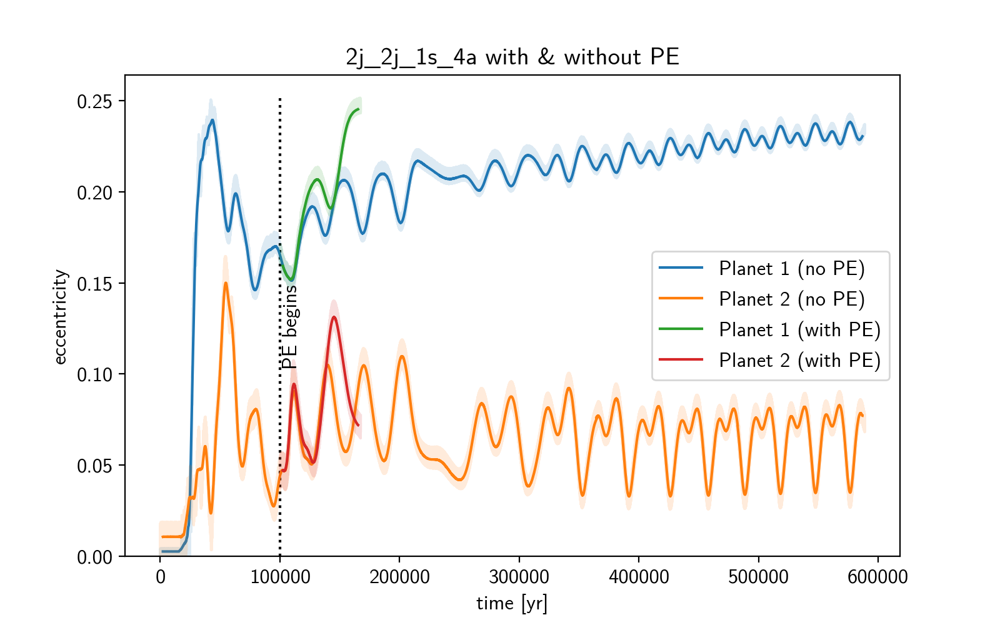
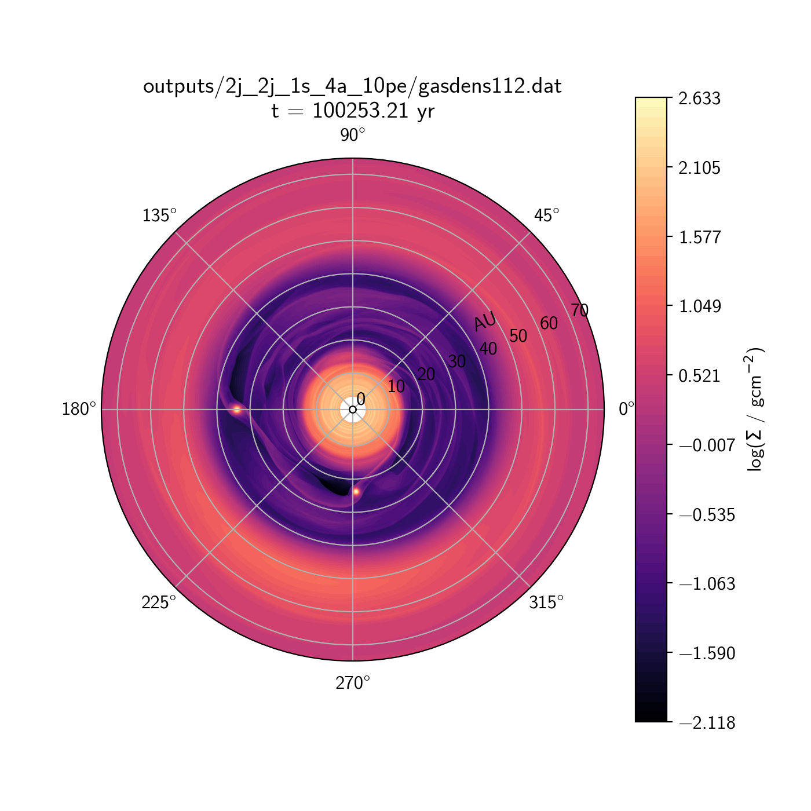
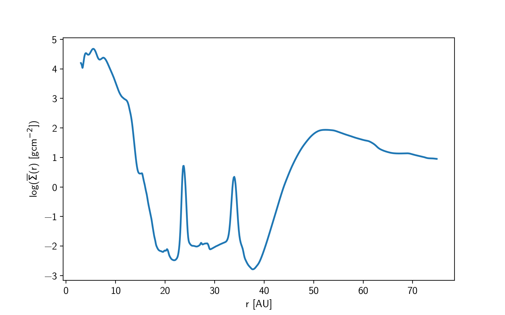

---
status:
m1:
m2:
sigma:
alpha:
photoevaporation:
---

notes::
semi_major_axes_plot:: 
period_ratio:: 2.03 ± 0.00
period_ratio_plot:: 
suggested_resonance:: 2:1
resonant_angles_plot:: 
eccentricity_plot:: 
e1:: 0.168
e2:: 0.045
gas_density_plot:: 
azimuthally_avged_surface_density_plot:: 
