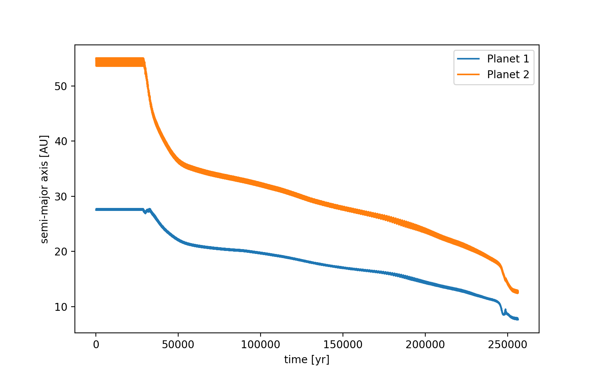
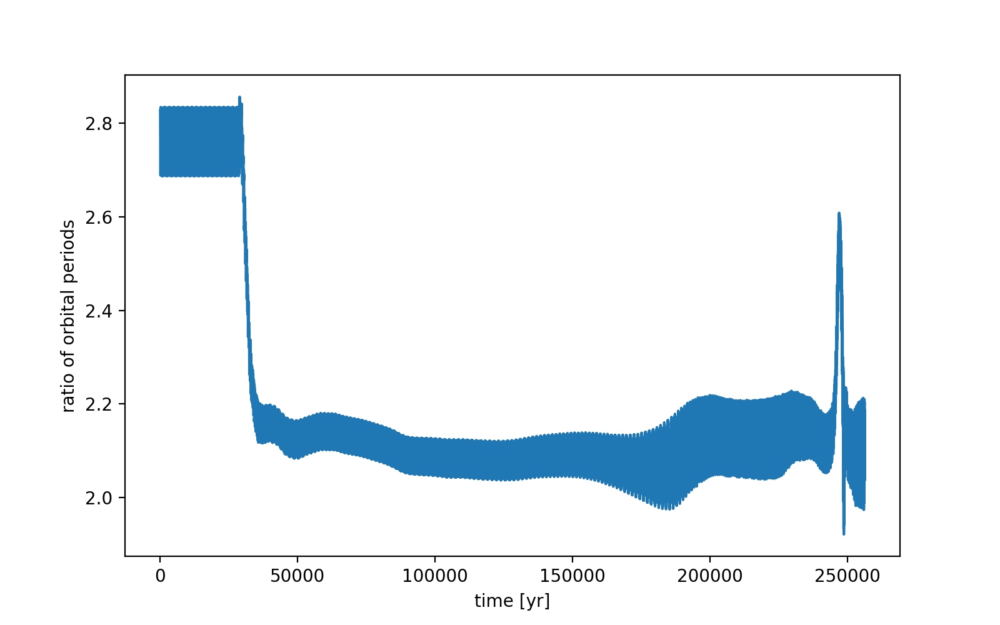
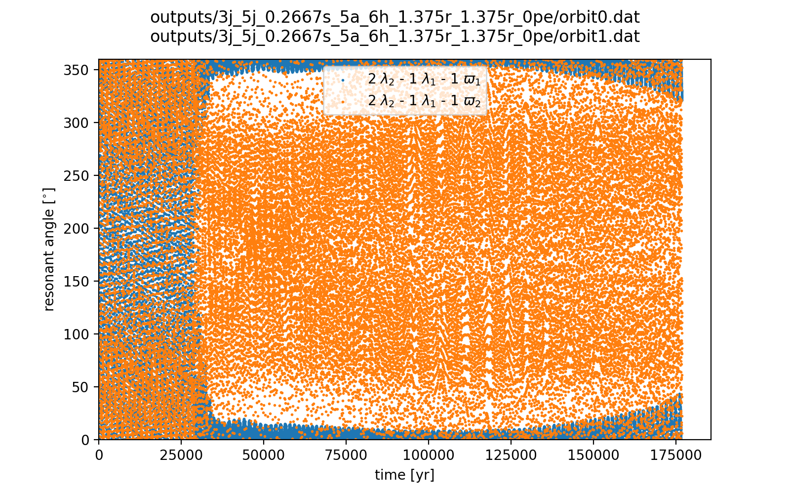
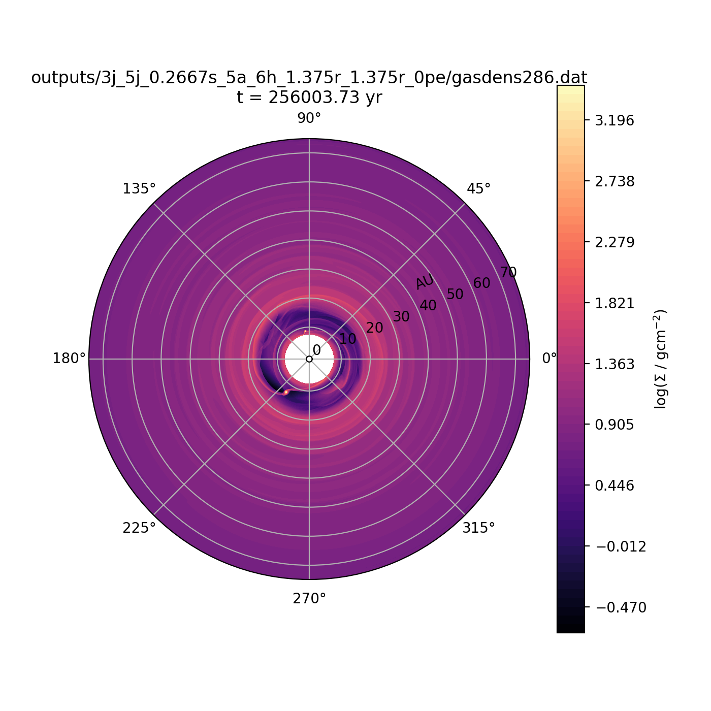
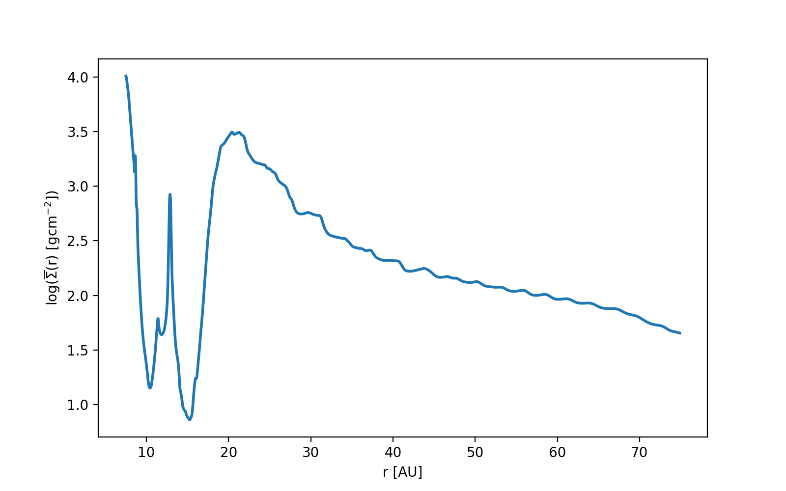

notes:: doesn't properly enter resonance (period ratio ~2.1)
semi_major_axes_plot:: 
period_ratio:: 2.16 ± 0.11
period_ratio_plot:: 
suggested_resonance:: 
resonant_angles_plot:: 
eccentricity_plot:: 
e1:: 0.070
e2:: 0.015
gas_density_plot:: 
azimuthally_avged_surface_density_plot:: 
