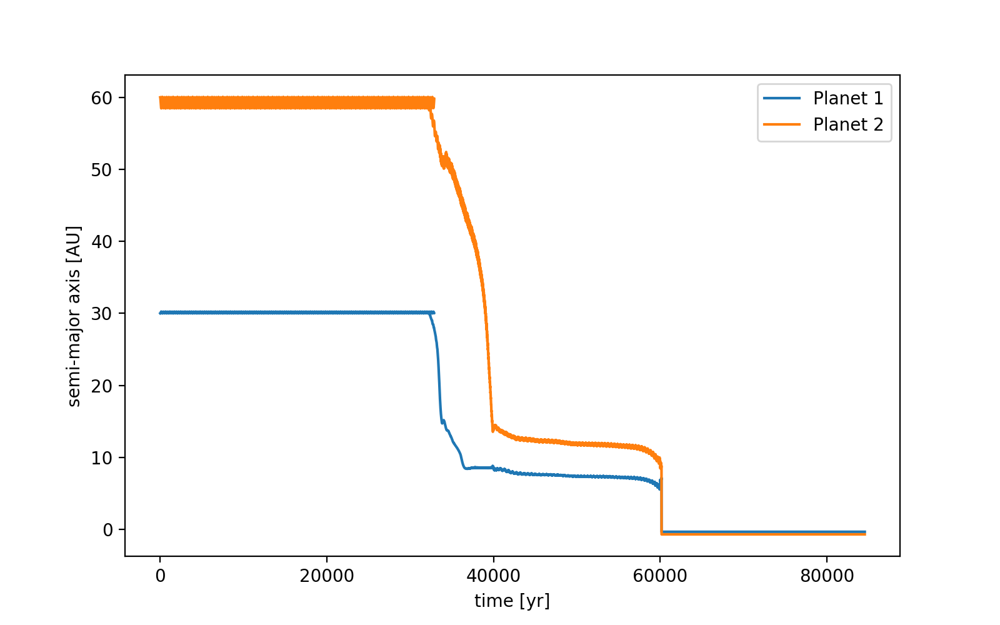
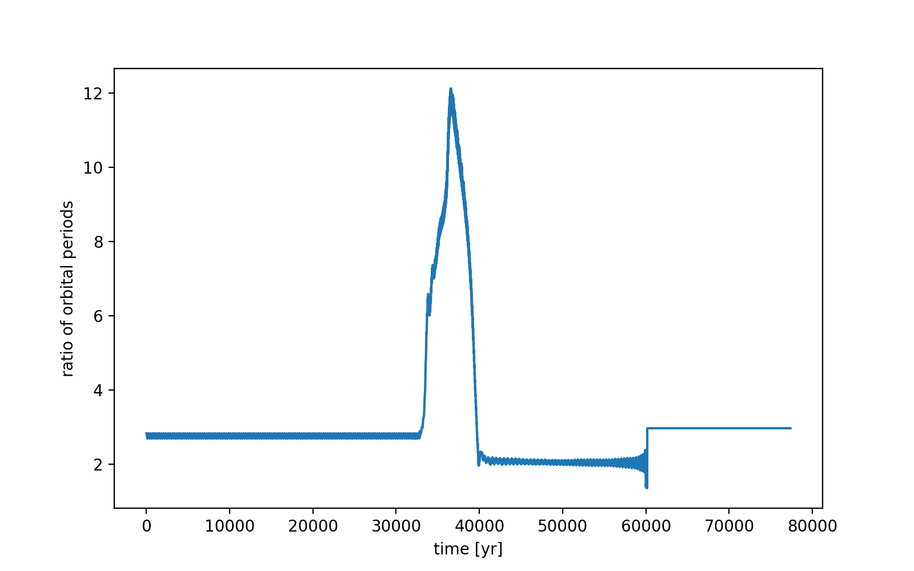
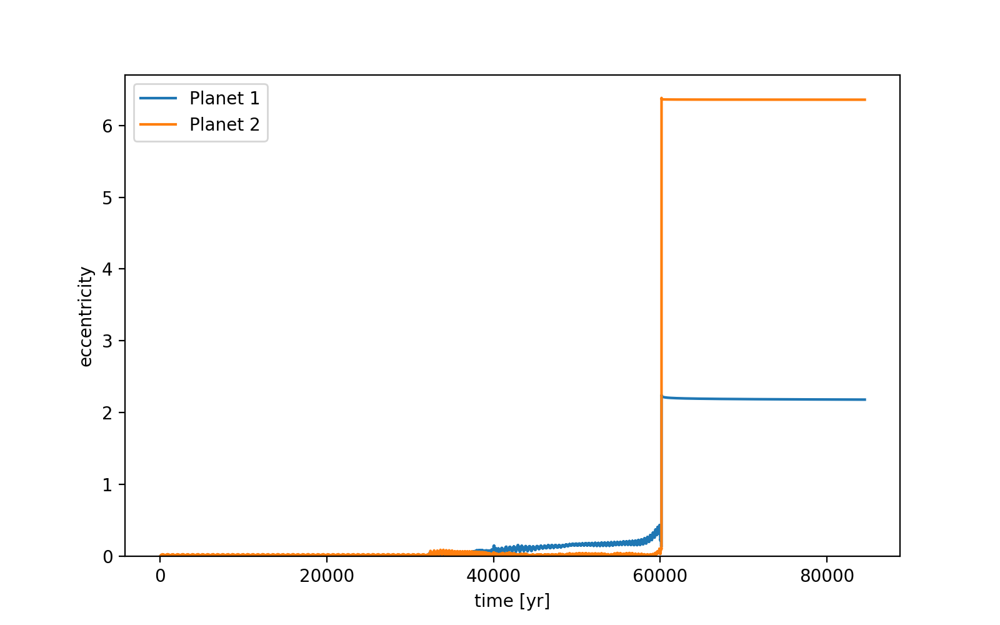
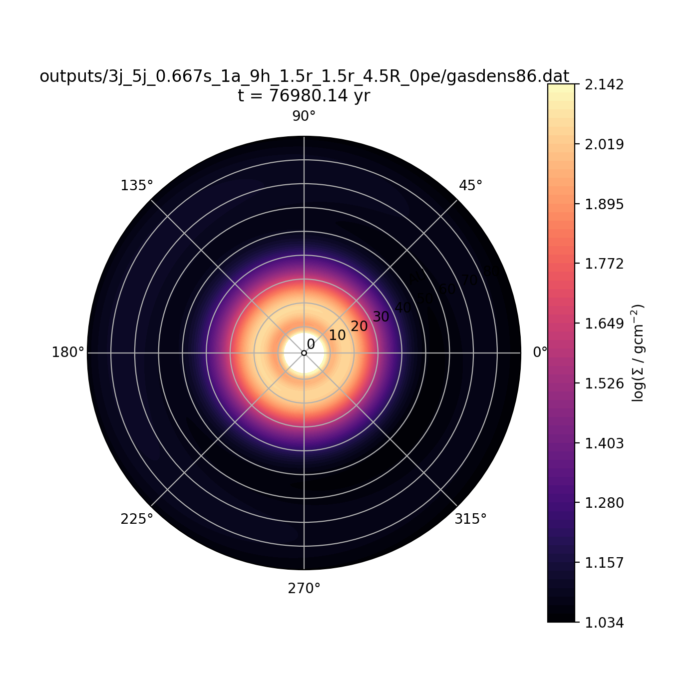
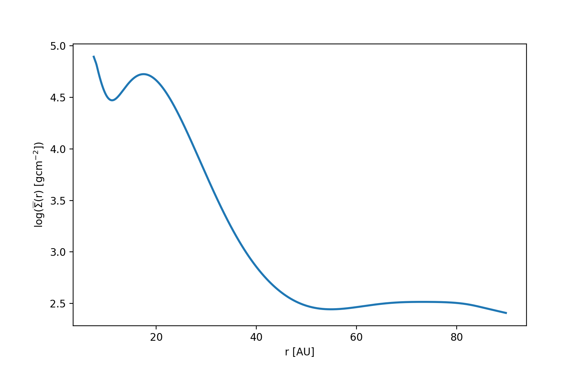

notes:: falls into star
semi_major_axes_plot:: 
period_ratio:: 2.97 ± 0.00
period_ratio_plot:: 
suggested_resonance:: 
resonant_angles_plot:: 
eccentricity_plot:: 
e1:: 2.183
e2:: 6.359
gas_density_plot:: 
azimuthally_avged_surface_density_plot:: 
