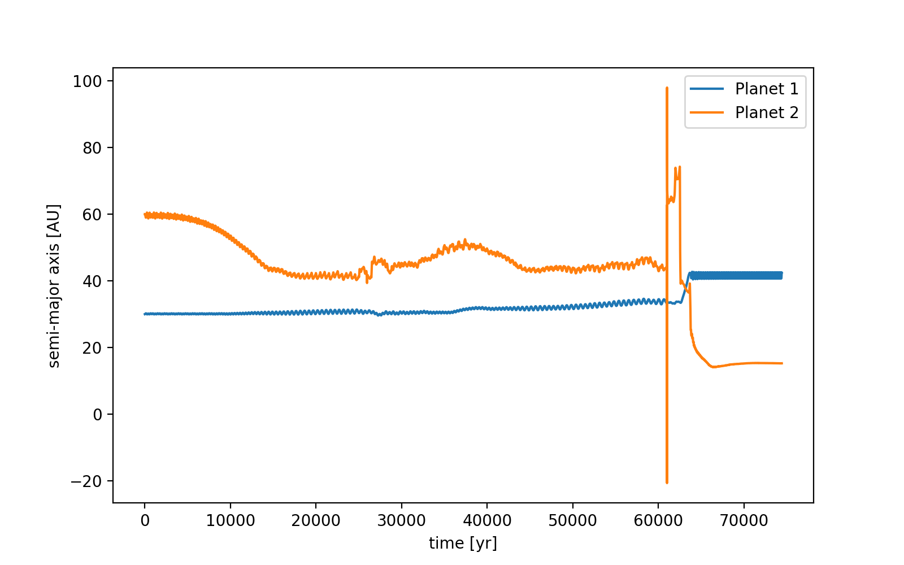
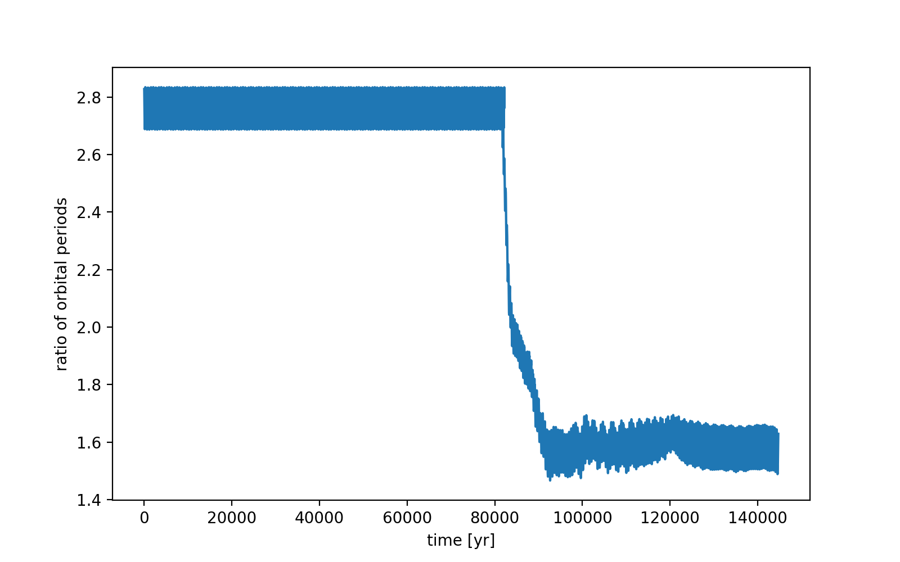
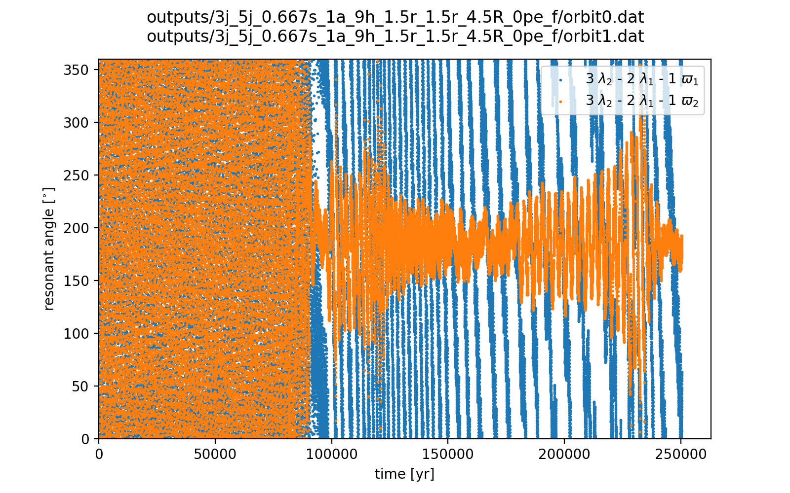
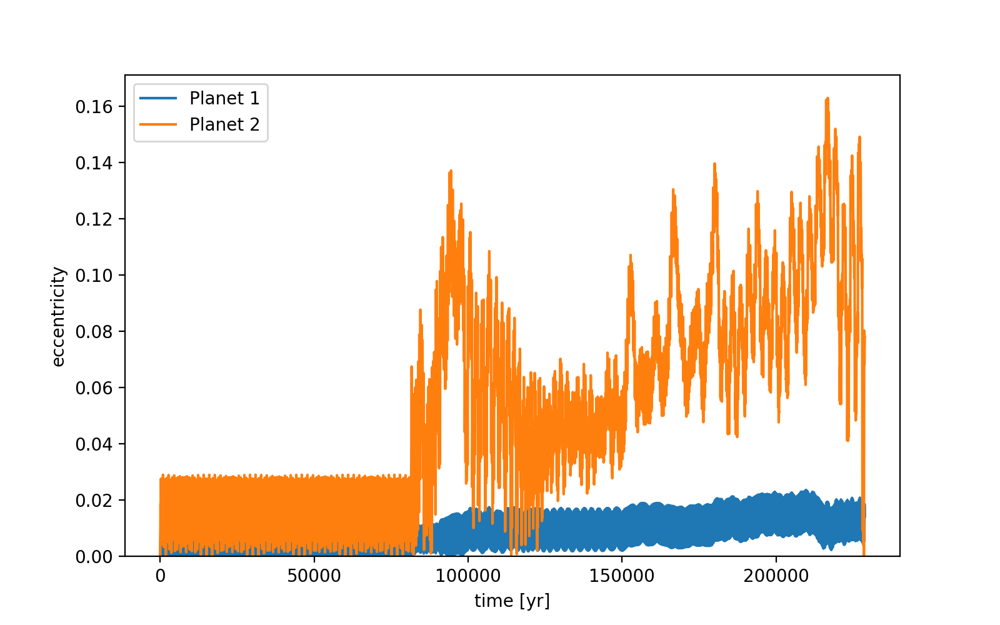
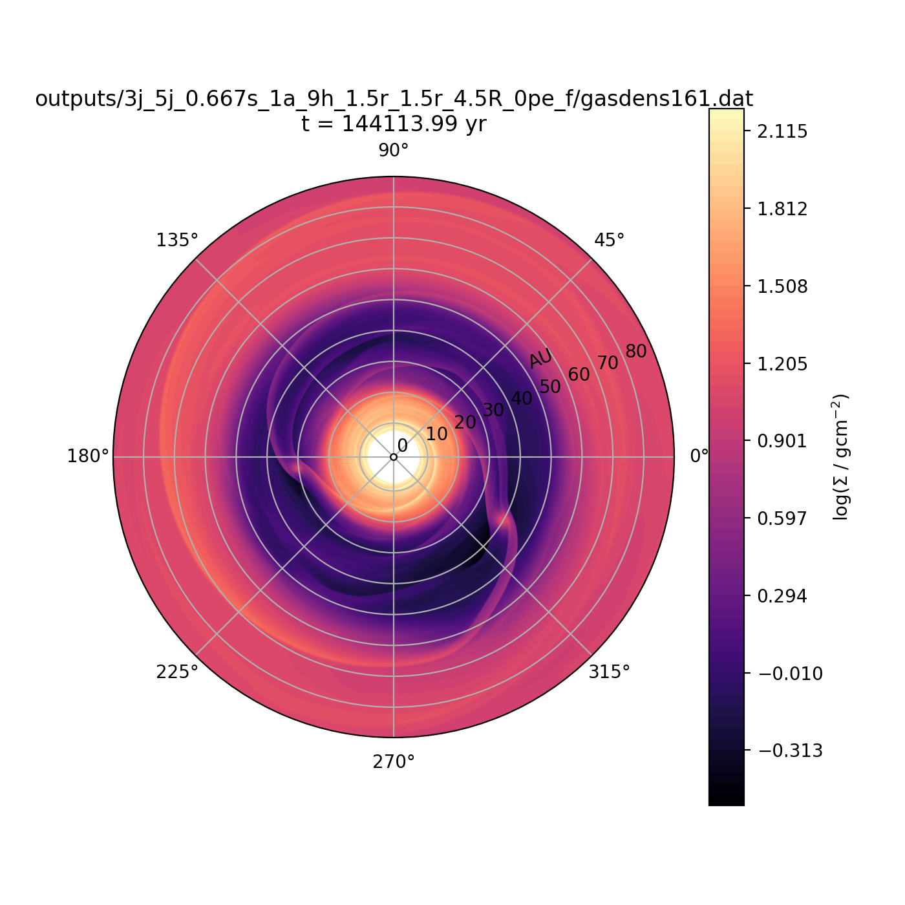
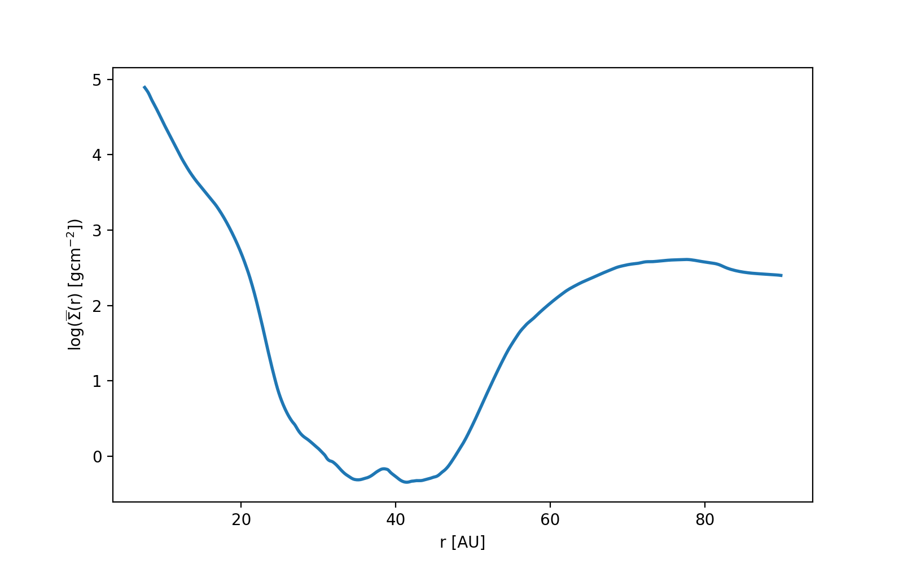

notes:: "almost 3:2 resonance"
semi_major_axes_plot:: 
period_ratio:: 1.55 ± 0.06
period_ratio_plot:: 
suggested_resonance:: 3:2
resonant_angles_plot:: 
eccentricity_plot:: 
e1:: 0.012
e2:: 0.079
gas_density_plot:: 
azimuthally_avged_surface_density_plot:: 
