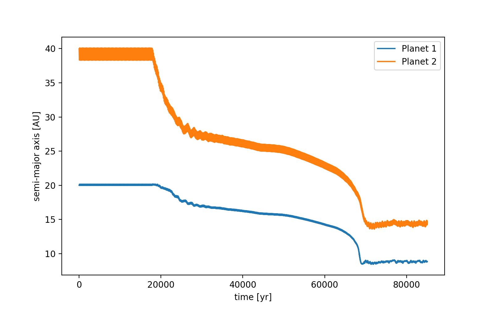
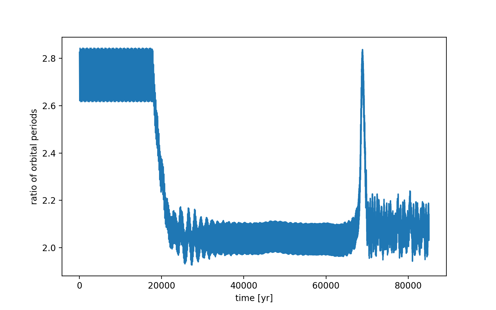
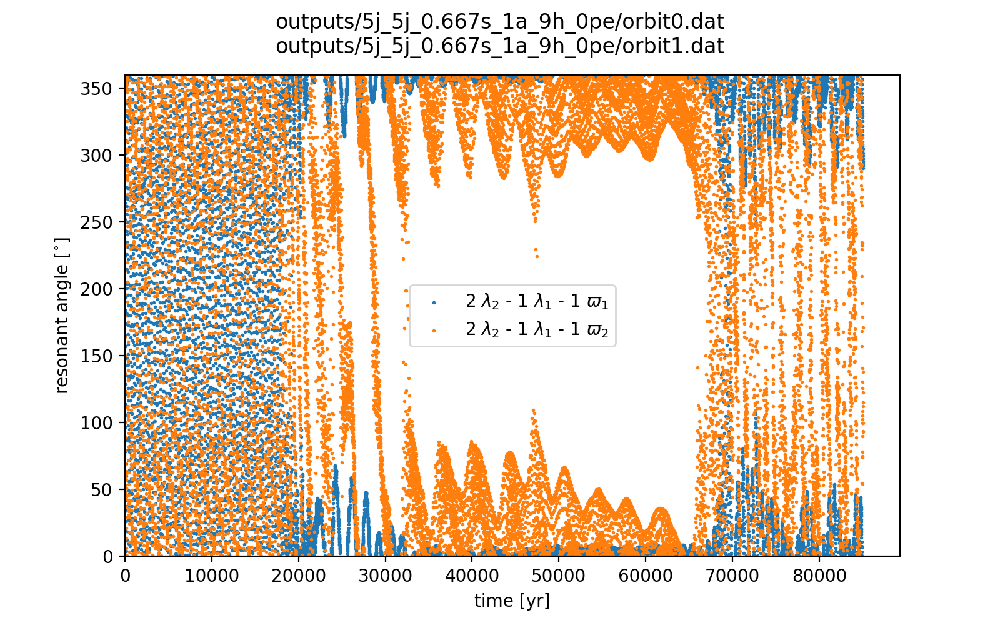
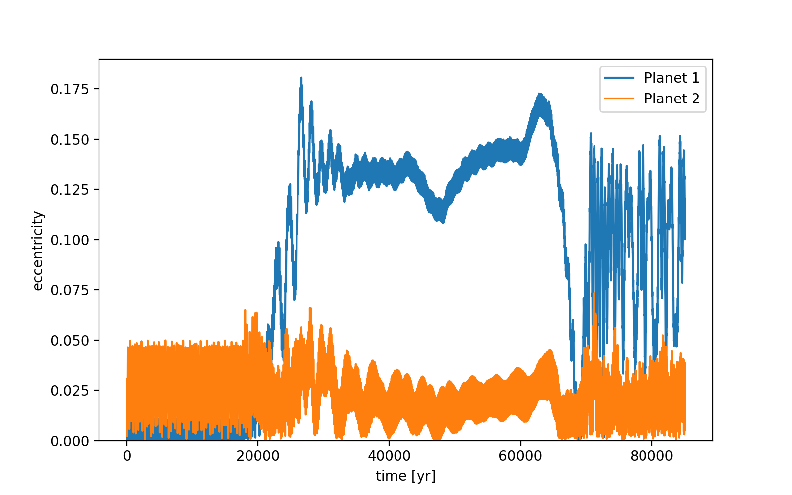
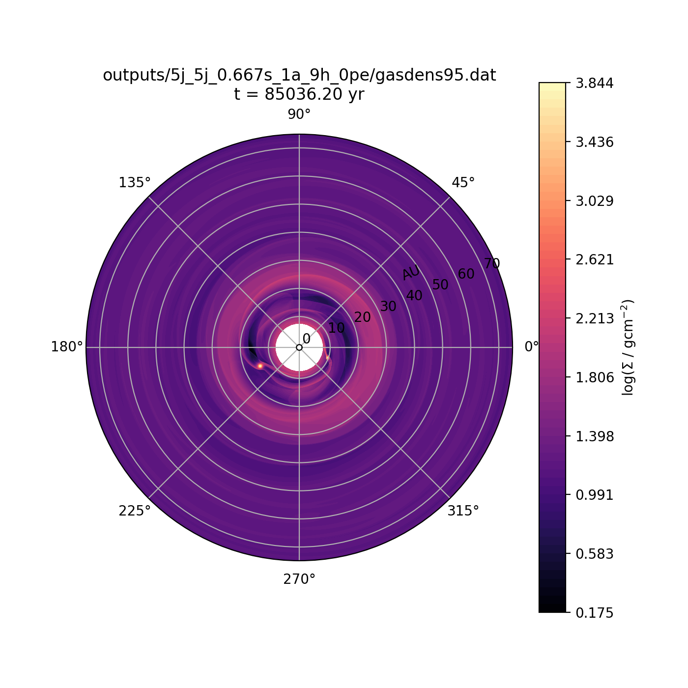
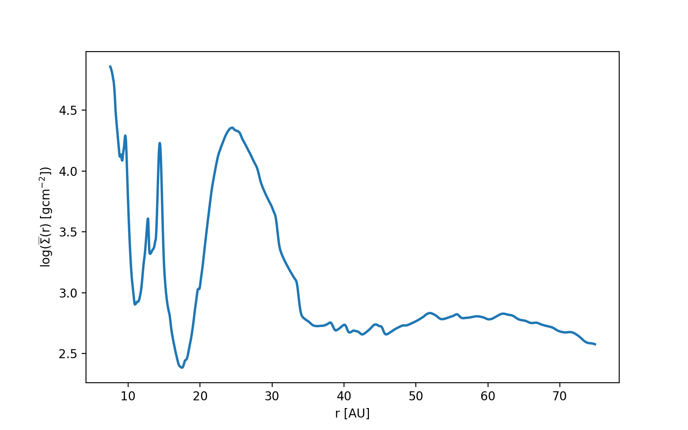

notes:: "2:1 resonance, but then planets fall towards star"
semi_major_axes_plot:: 
period_ratio:: 2.09 ± 0.06
period_ratio_plot:: 
suggested_resonance:: 2:1
resonant_angles_plot:: 
eccentricity_plot:: 
e1:: 0.095
e2:: 0.020
gas_density_plot:: 
azimuthally_avged_surface_density_plot:: 
