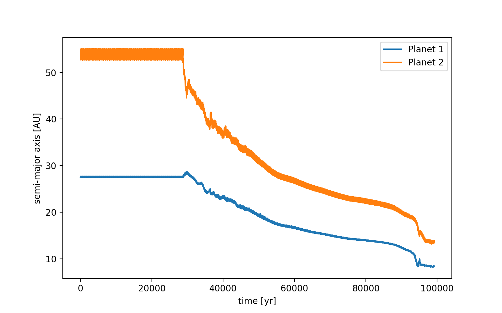
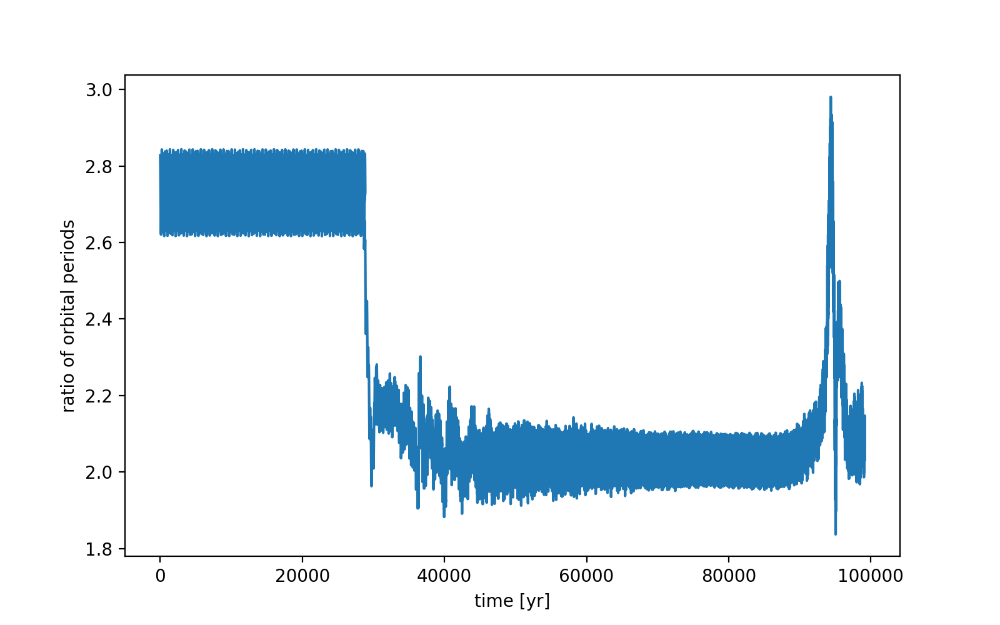
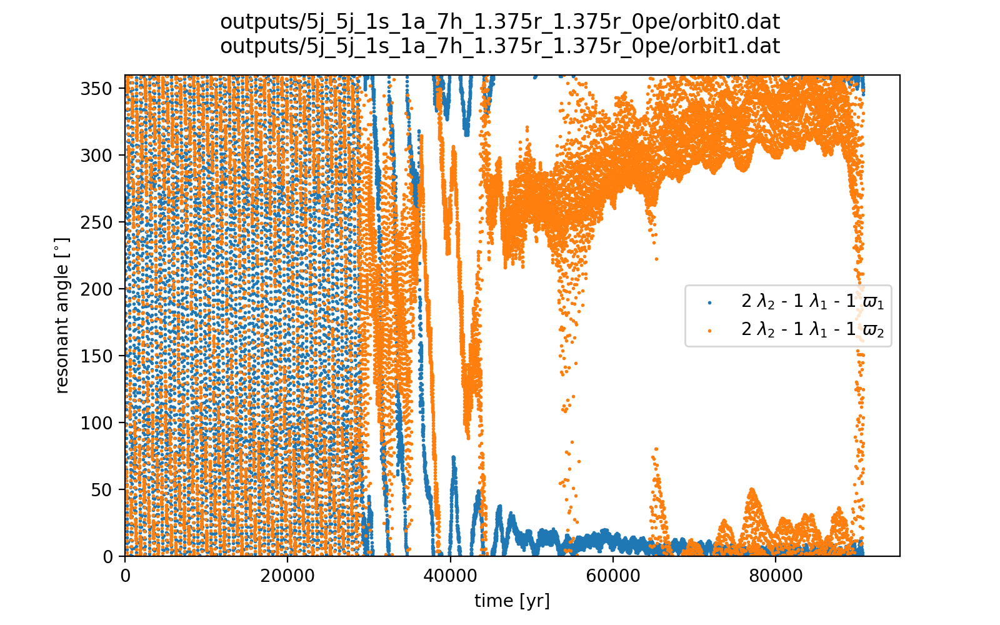
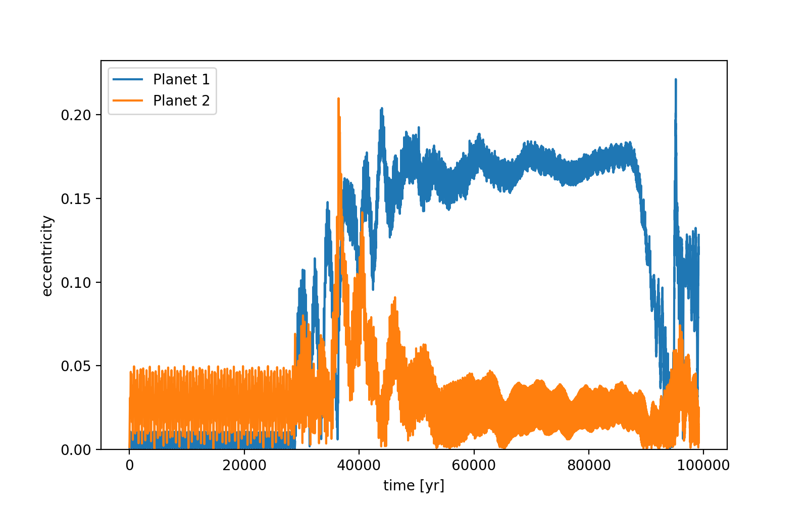
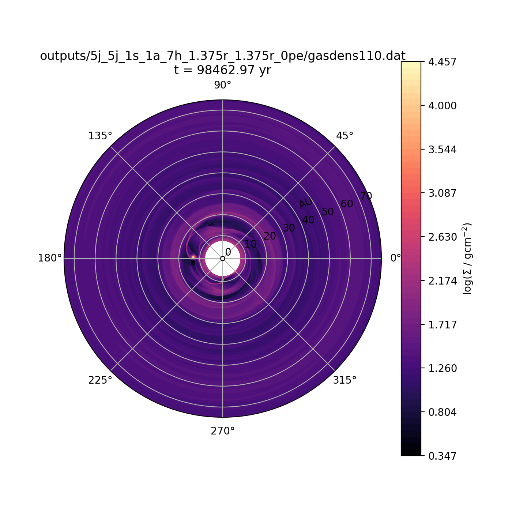
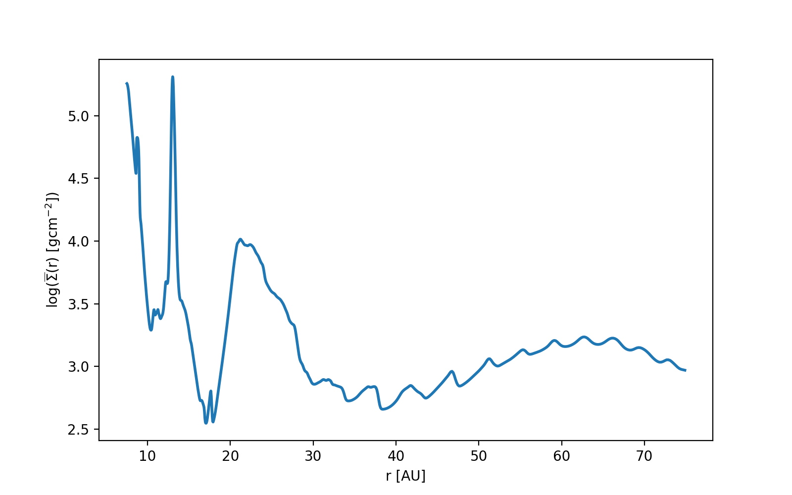

notes:: "2:1 resonance, planets falling towards star, hitting inner boundary"
semi_major_axes_plot:: 
period_ratio:: 2.18 ± 0.19
period_ratio_plot:: 
suggested_resonance:: 
resonant_angles_plot:: 
eccentricity_plot:: 
e1:: 0.089
e2:: 0.023
gas_density_plot:: 
azimuthally_avged_surface_density_plot:: 
