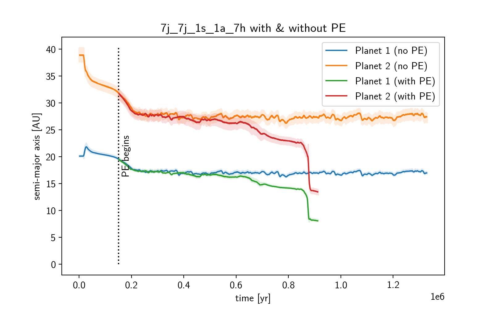
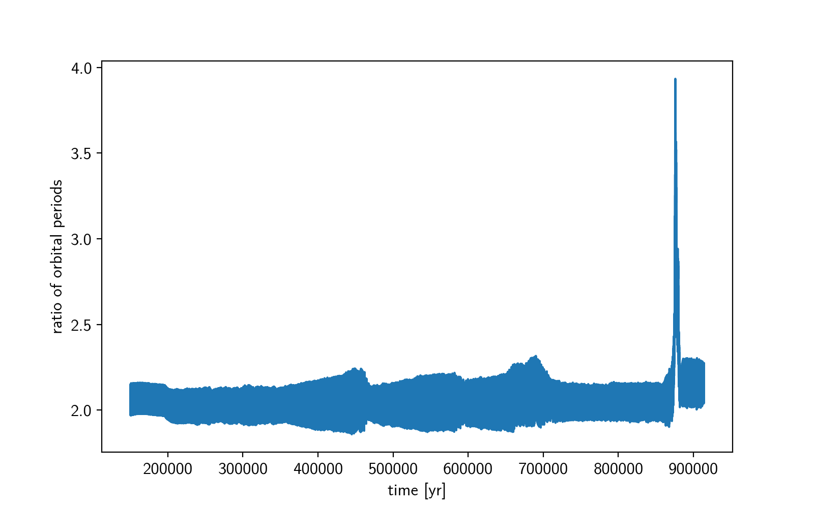
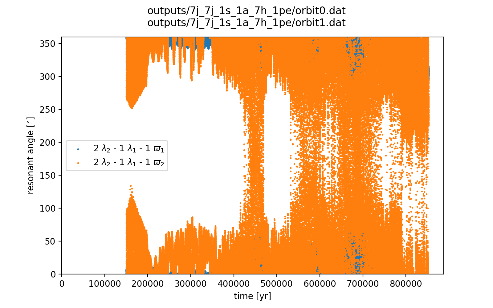
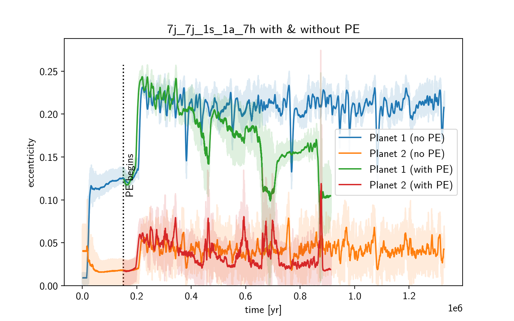
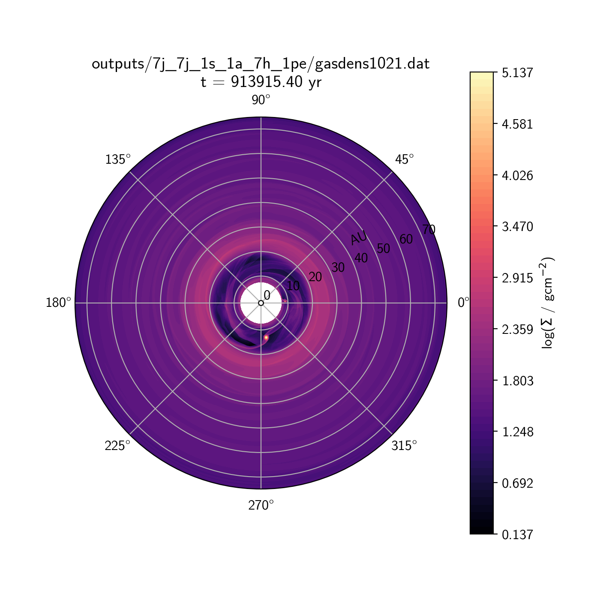
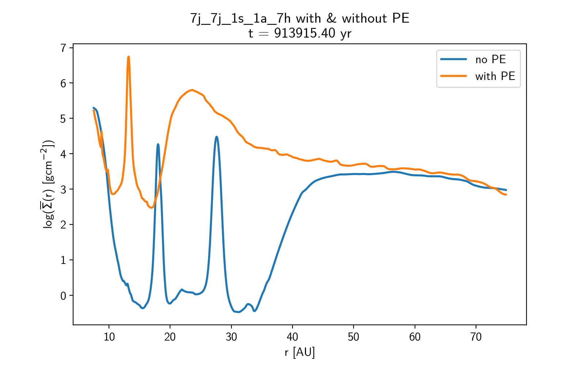

notes:: PE causes planets to leave resonance, $e_1$ declines?
semi_major_axes_plot:: 
period_ratio:: 2.16 ± 0.23
period_ratio_plot:: 
suggested_resonance:: 
resonant_angles_plot:: 
eccentricity_plot:: 
e1:: 0.130
e2:: 0.032
gas_density_plot:: 
azimuthally_avged_surface_density_plot:: 
