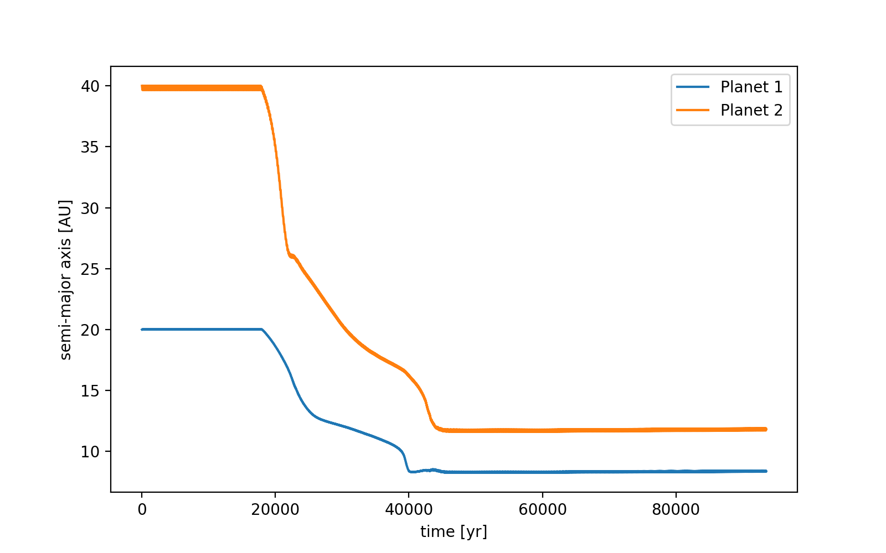
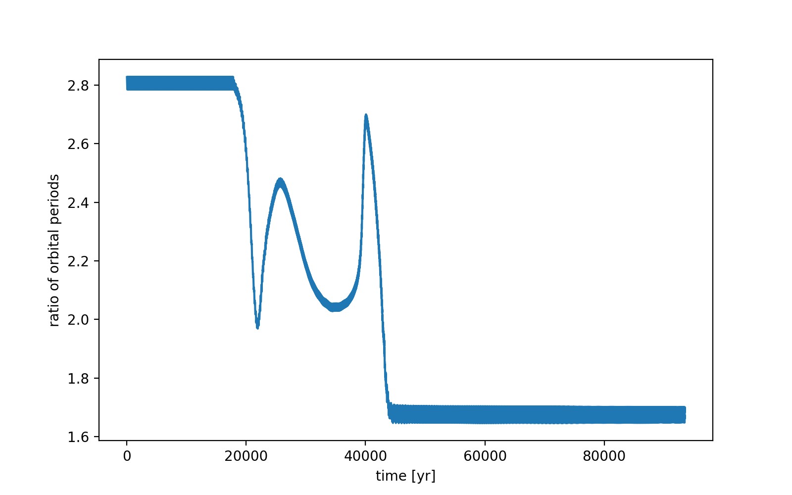
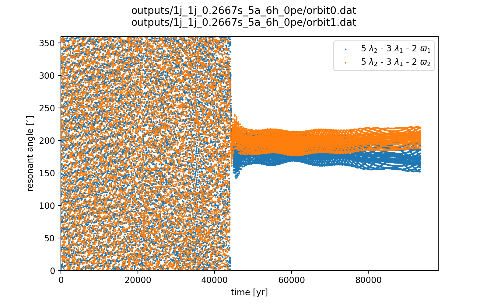
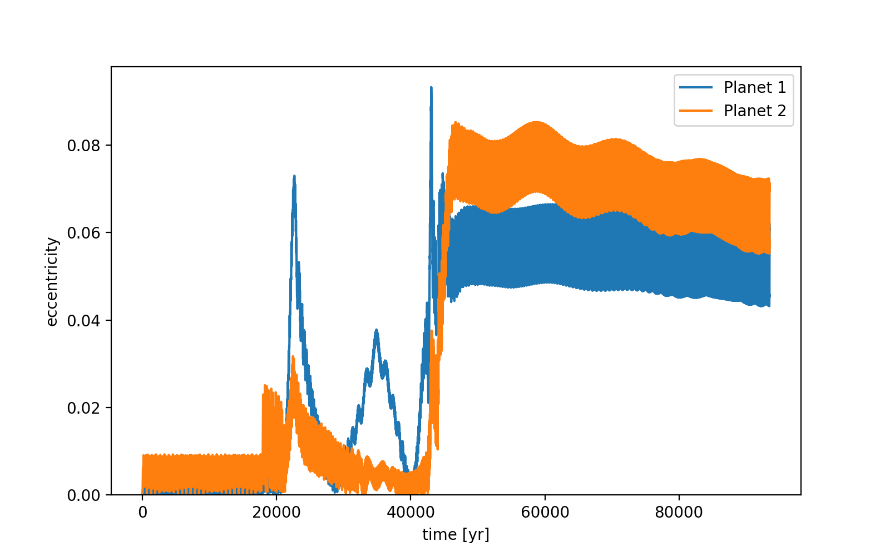
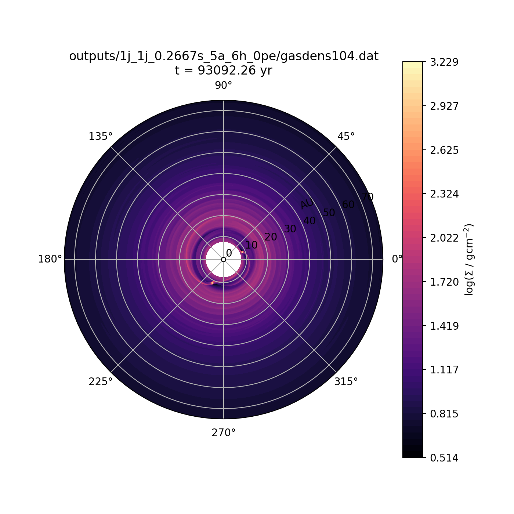
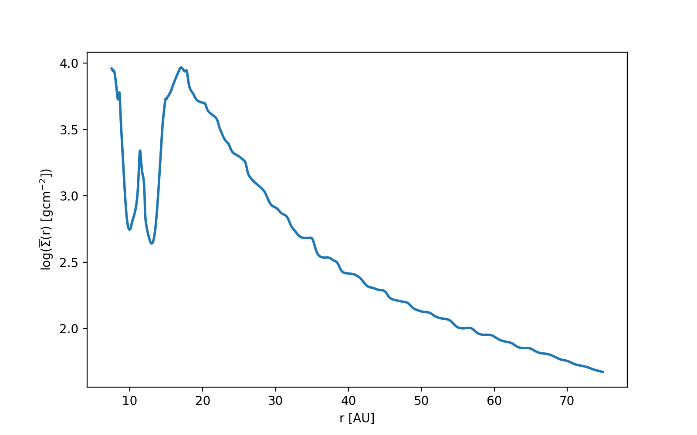

notes:: hits inner boundary
semi_major_axes_plot:: 
period_ratio:: 1.68 ± 0.02
period_ratio_plot:: 
suggested_resonance:: 5:3
resonant_angles_plot:: 
eccentricity_plot:: 
e1:: 0.054
e2:: 0.066
gas_density_plot:: 
azimuthally_avged_surface_density_plot:: 
