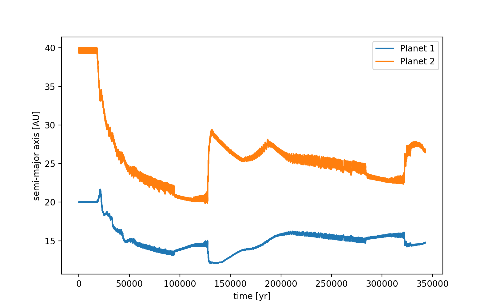
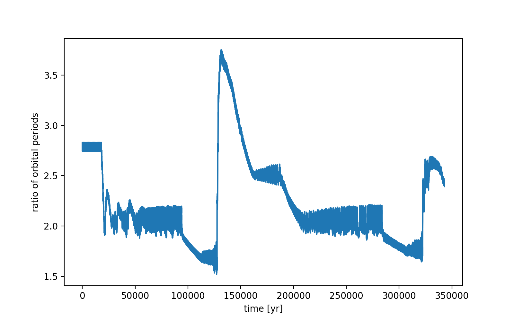
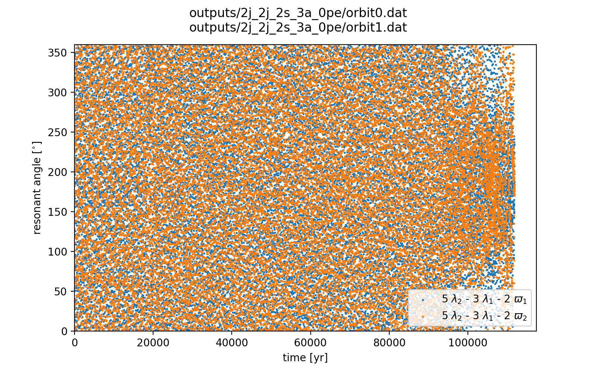
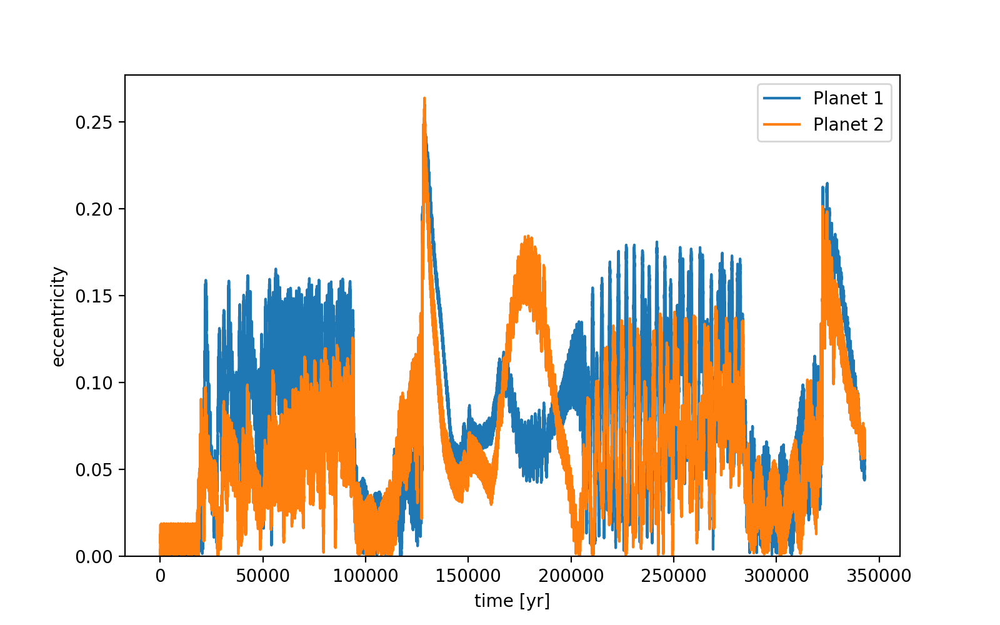
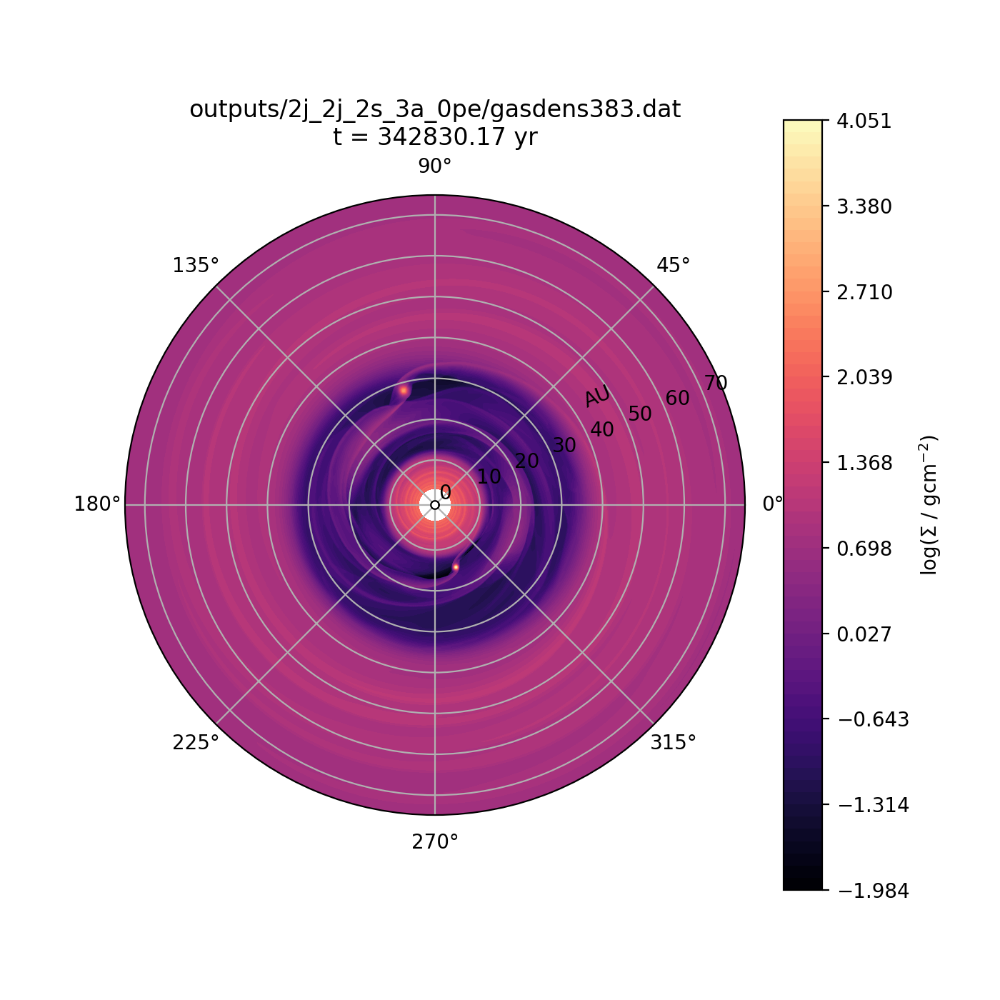
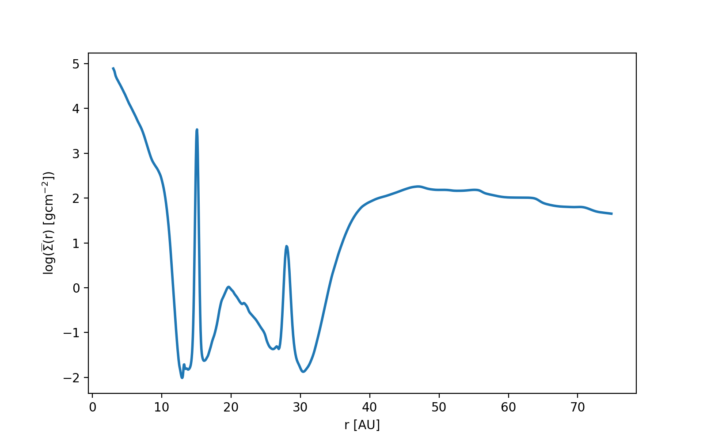

notes:: "doesn't stay in 2:1 resonance"
semi_major_axes_plot:: 
period_ratio:: 2.23 ± 0.39
period_ratio_plot:: 
suggested_resonance:: 
resonant_angles_plot:: 
eccentricity_plot:: 
e1:: 0.105
e2:: 0.089
gas_density_plot:: 
azimuthally_avged_surface_density_plot:: 
