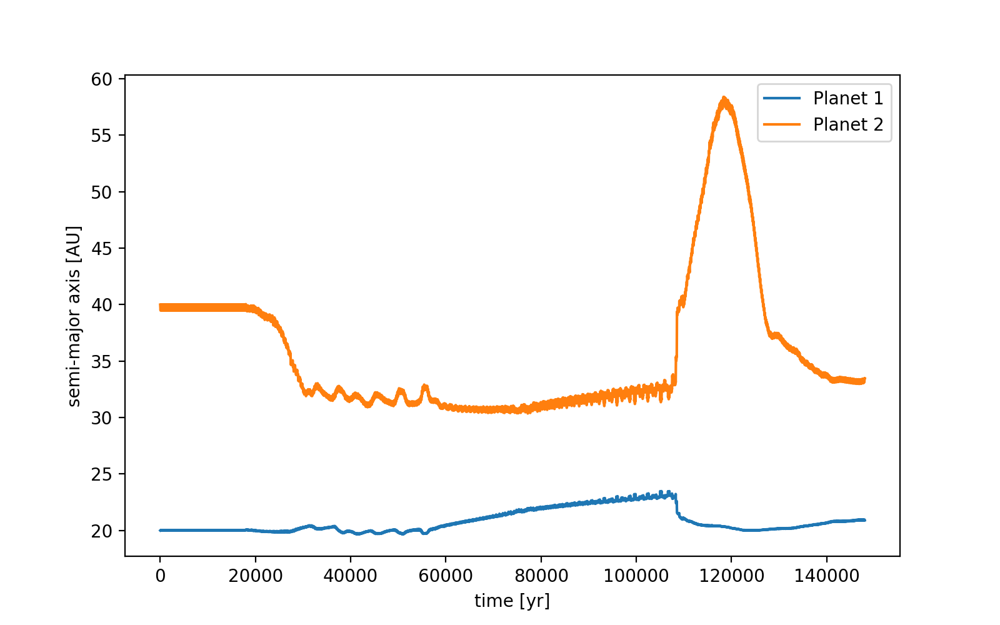
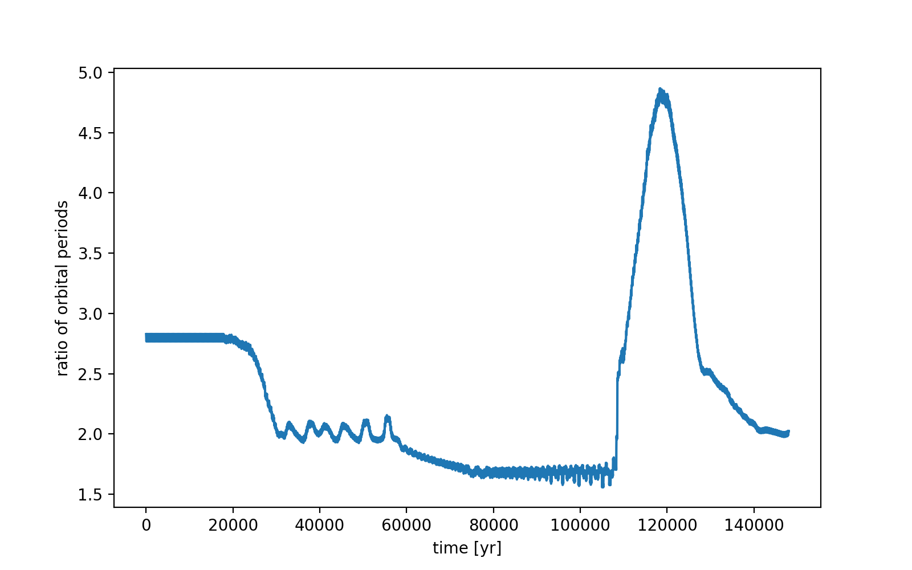
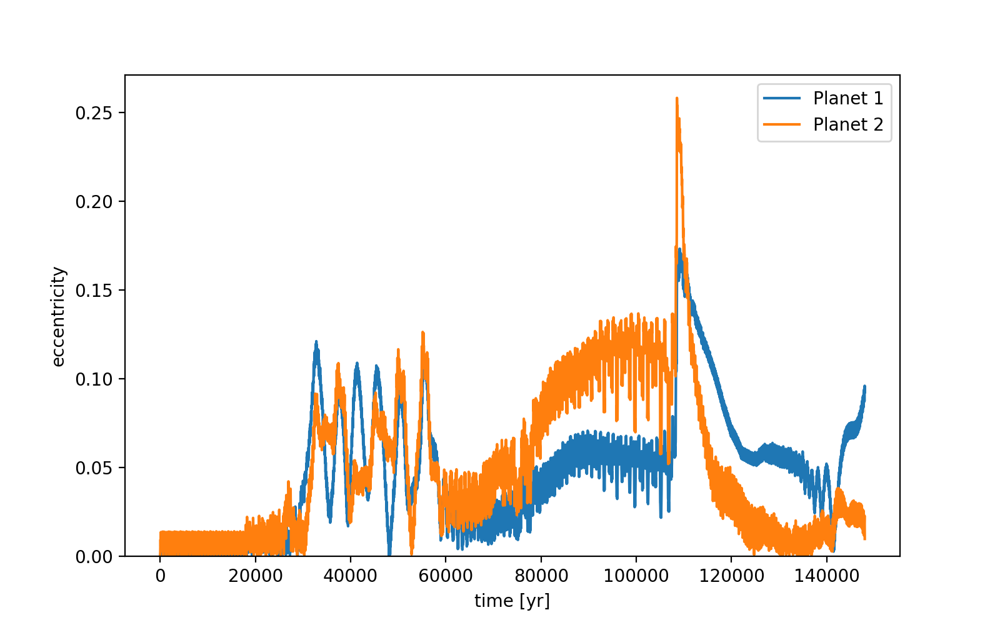
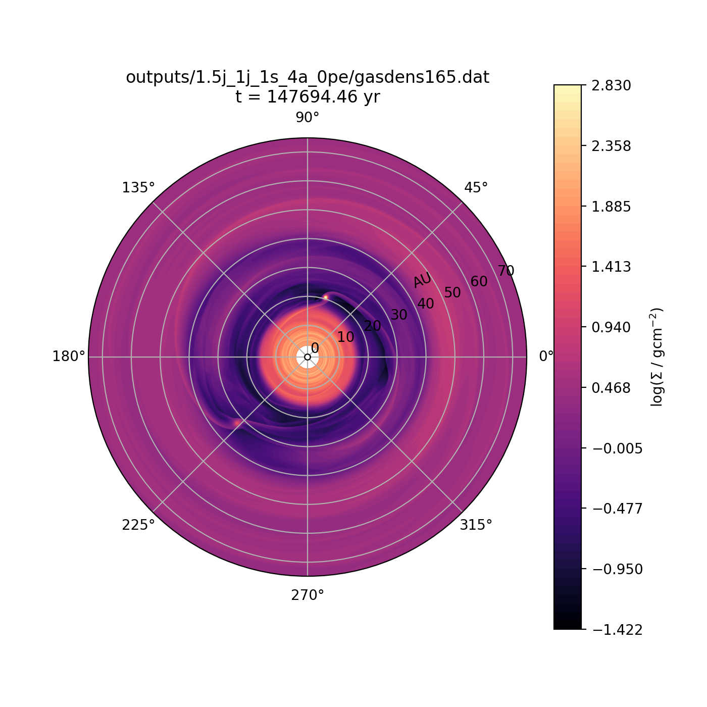
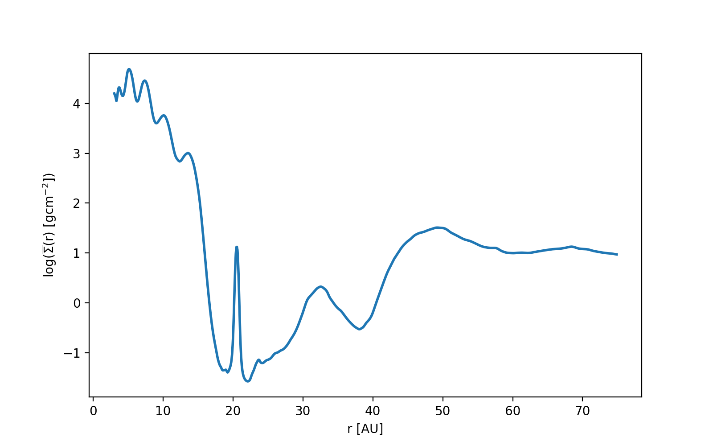

notes:: "2:1 then 5:3 resonance, then planets get flung apart"
semi_major_axes_plot:: 
period_ratio:: 2.11 ± 0.11
period_ratio_plot:: 
suggested_resonance:: 
resonant_angles_plot:: 
eccentricity_plot:: 
e1:: 0.050
e2:: 0.018
gas_density_plot:: 
azimuthally_avged_surface_density_plot:: 
