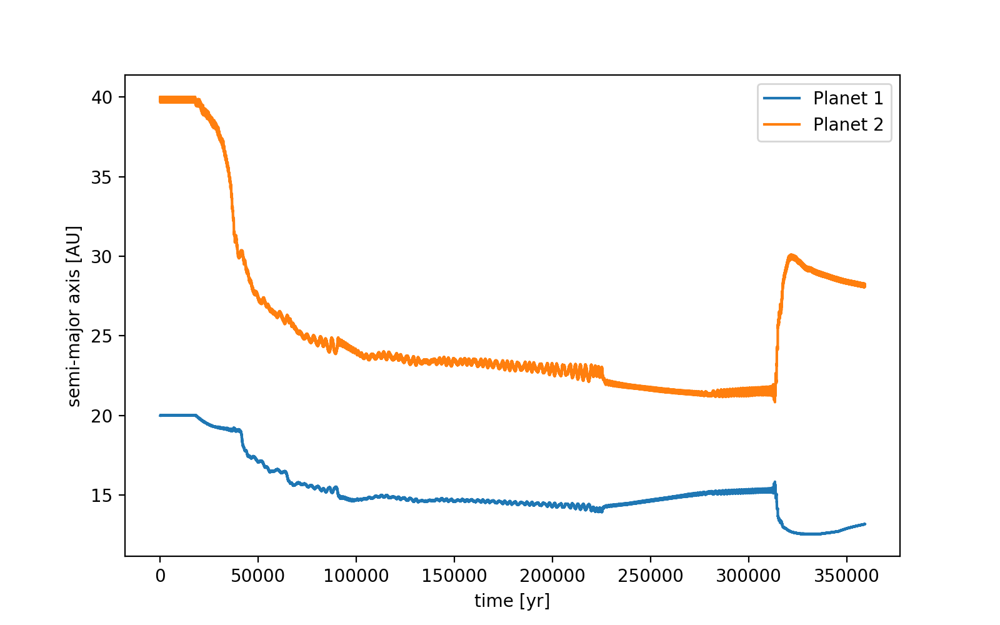
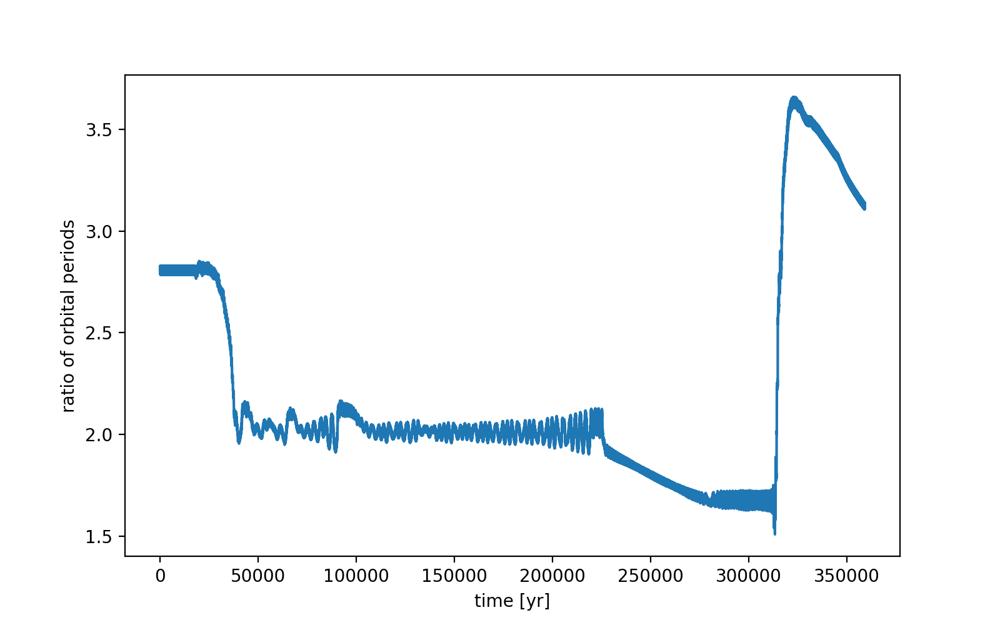
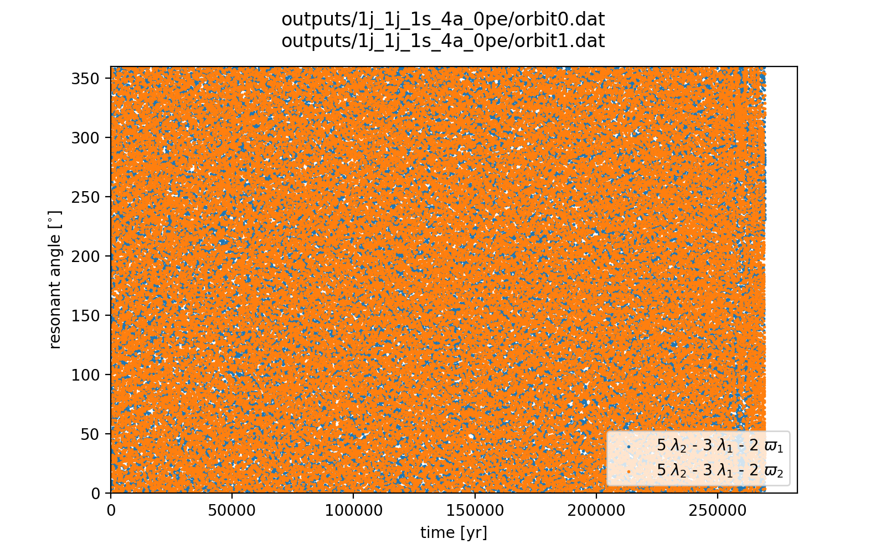
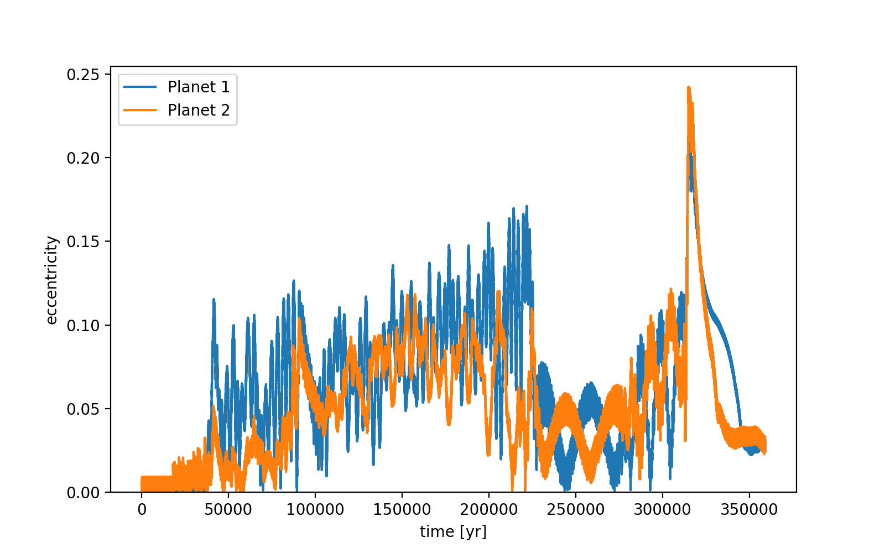
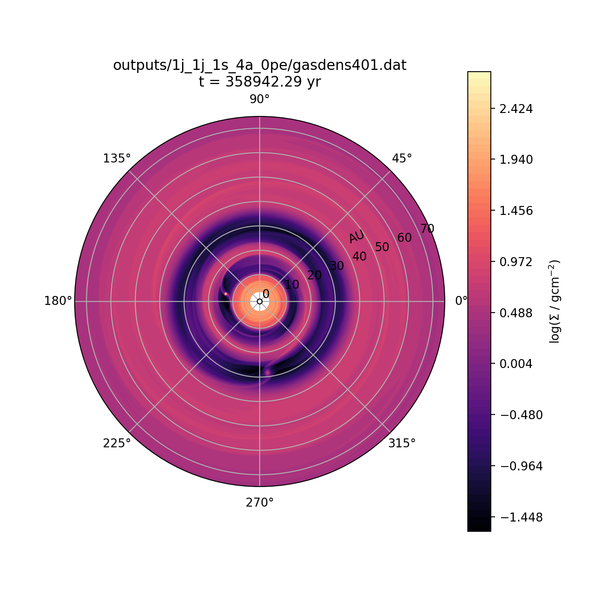
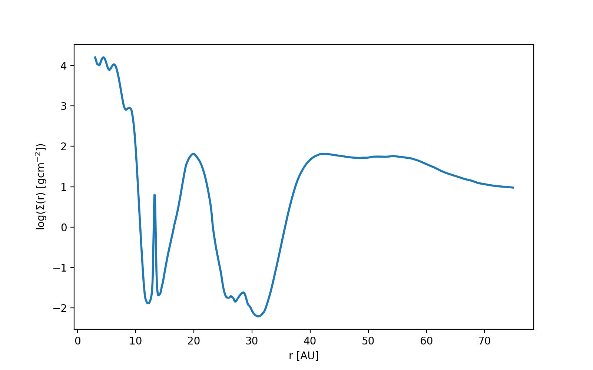

notes:: "initially 2:1 resonance, then period ratio drops"
semi_major_axes_plot:: 
period_ratio:: 3.40 ± 0.15
period_ratio_plot:: 
suggested_resonance:: 
resonant_angles_plot:: 
eccentricity_plot:: 
e1:: 0.066
e2:: 0.047
gas_density_plot:: 
azimuthally_avged_surface_density_plot:: 
